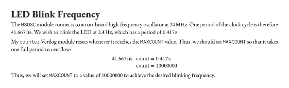
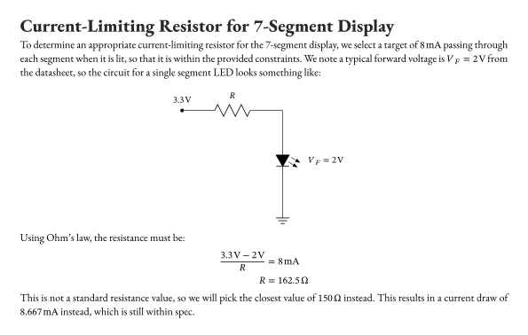
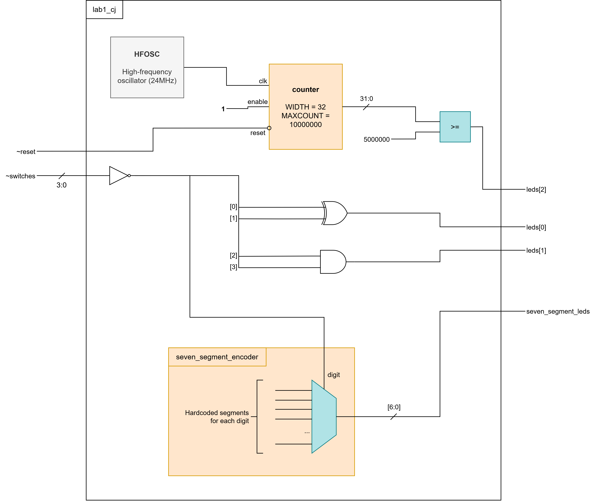
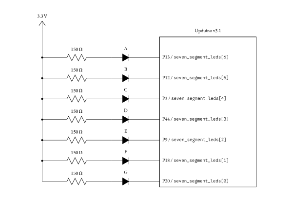
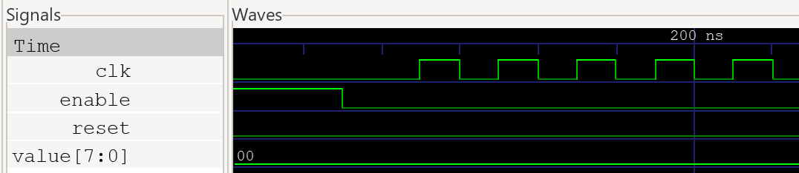

## Introduction

In this lab, I assembled the development board used for the class and tested the MCU and FPGA boards. Then, I wrote a Verilog module to control LEDs and a 7-segment display and uploaded it to the FPGA. Finally, I wired up an external 7-segment display to the board to display different hexadecimal digits, which could be controlled by the on-board DIP switches.

## Design and Testing Methodology

### Onboard LEDs

The first lab deliverable called for a Verilog module to control 3 on-board LEDs according to the state of the four on-board DIP switches. Truth tables were given for `led[0]` and `led[1]`, while `led[2]` was to be blinked at 2.4Hz using the on-board oscillator.

The truth tables for the first two LEDs can be simplified to:

```
led[0] = S0 ^ S1
led[1] = S2 & S3
```

These can simply be implemented via `assign` statements in the top-level Verilog module.

For the third LED, a blink rate of 2.4Hz is needed, but the onboard oscillator provides a frequency of 48MHz (note: I had to divide this down to 24MHz since I was getting timing violations for running the clock too fast). I wrote a `counter` module in Verilog to achieve the desired frequency. It accepts `clk`, `reset`, and `enable` as inputs, and outputs the current value of its counter. The module also accepts the `WIDTH` and `MAXCOUNT` parameters, which control the number of bits in the counter and the maximum value before overflowing to zero, respectively.

If we set `MAXCOUNT` such that it takes one period of 2.4Hz to overflow to zero, we can set `led[2] = (counter_value >= MAXCOUNT/2)` to have it blink at the right frequency. I used the following calculations to determine the right value of `MAXCOUNT`:

::: {.callout-note collapse="true"}
## Spoiler: Click to show calculations

:::

### 7-Segment Display

The other lab deliverable called for a Verilog module and circuit to control an external 7-segment display. The module should interpret `S[3:0]` as a binary number and control pins on the FPGA to display the corresponding hexadecimal digit.

The Verilog module is fairly straightforward. There are only 16 possible hexadecimal digits, so we can simply write a `case` block to enumerate over all the possible digits and hardcode what segments should be lit in each case. Since we are using a common anode display, a `0` turns the segment ON, while a `1` keeps it off.

::: {.callout-note collapse="true"}
## Spoiler: Click to show code

Here's part of the Verilog module. The full code can be viewed in the GitHub repository for this lab.

```sv
module seven_segment_encoder(
  input logic [3:0] digit,
  output logic [6:0] segments
);
  always_comb begin
    unique case (digit)
      // Format of segments[6:0] is ABCDEFG
      // Display is common anode so a 0 turns the segment ON
      4'b0000: segments = 7'b0000001; // 0
      4'b0001: segments = 7'b1001111; // 1
      // ...
    endcase
  end
endmodule
```
:::

Next, we need to design the actual circuit itself. The +3.3V from the FPGA obviously connects to the common anode of the display. Then, I chose 7 FPGA pins not in use by anything else to control the segments of the display. Each pin will be connected through a current-limiting resistor to one of the segments so that the current running through each segment is anywhere between 5-20mA. The following calculations were used to determine a suitable resistance value:

::: {.callout-note collapse="true"}
## Spoiler: Click to show calculations

:::

## Technical Documentation

A link to the code used in this lab can be found [at this GitHub repository](https://github.com/conjoneshmc/e155-labs).

### Block Diagram



The figure above shows the block diagram for the top-level Verilog module. The high-frequency oscillator module drives an internal clock, which is connected to a counter to make `leds[2]` blink at the appropriate frequency. `leds[0]` and `leds[1]` are driven directly by logic gates through a top-level `assign` statement. Finally, the switch values are fed directly to the `seven_segment_encoder` module, which is really just a 4-bit lookup table to encode all 16 hexadecimal digits as segments on the 7-segment display.

Note that `~reset` and `~switches` are active low, so I inverted these signals before using them in my code.

### Schematic



The figure above shows the schematic for the 7-segment display. Each segment is connected through the common anode of the display to the +3.3V pin on the FPGA, and the cathodes of each segment are connected to individual GPIO pins. Current-limiting resistors (whose values were calculated in the previous section) are placed in series with each segment to limit the current draw from the FPGA.

## Results and Discussion

### Testbench for Top-Level Module


The waveforms above demonstrate correct top-level module behavior. In particular, note that:

- `led_counter.reset` is always the opposite of top-level input `reset_bar`
- `led_counter.clk` tracks `hf_osc_clk`
- `led_counter.value` is properly connected to `led_counter_value` (a logic variable internal to the top-level module used to control whether `leds[2]` should be lit)
- `encoder.segments` is properly connected to the top-level output `seven_segment_leds`
- `encoder.digit` is always the inverse of `switches_bar` (since the switches are active low)
- `leds[1:0]` demonstrate the correct logic assignments according to the value of `switches_bar`
  - For example, when `switches_bar` is `1101`, `s[1:0] = 10` and `leds[0] = 1`, which checks out since it was specified that `led[0] = s[1] ^ s[0]`

### Testbench for 7-Segment Module


The waveforms above demonstrate the `seven-segment-encoder` module working correctly. Every possible hexadecimal digit is tested and the segments are checked for displaying the correct number. (You may have to open the image in a new tab to view everything properly).

### Testbench for Counter

The `counter` module met all the intended design specifications, as shown by the following waveforms.


The waveforms above demonstrate the reset feature of the `counter` module working correctly. When `reset` is HIGH, `value` is always `0`, regardless of the `clk`. `reset` also works asynchronously. When `clk` is HIGH and `reset` changes from LOW to HIGH, `value` is immediately reset to 0, before the next clock cycle.




The waveforms above demonstrate the enable feature of the `counter` module working correctly. When `enable` is LOW, `value` retains its previous state and does not increment on the rising edge of `clk`.


The waveforms above demonstrate the `MAXCOUNT` feature of the `counter` module working correctly. In this case, `MAXCOUNT` was set to a value of 48. When `value` reaches 47, it overflows back to 0 on the next clock cycle.

### Hardware

The design also met all given specifications in hardware. The 2 on-board LEDs display the correct logic operations, and the other LED blinks at a rate of ~2.4Hz (measured with a stopwatch). The 7-segment display also uniquely displays all hexadecimal digits `0x0` though `0xF`, and all segments are equally bright regardless of how many segments are lit. The digit shown on the 7-segment-display is also correctly set according to the value of the switches.

## Conclusion

In this lab, I successfully assembled the development board and tested the MCU and FPGA boards. Then, I wrote Verilog modules to control 3 on-board LEDs and an external 7-segment display. All Verilog modules were tested in simulation and displayed the correct behavior. When the design was flashed to the FPGA, the behavior also correctly met the specifications.

I spent a total of **28 hours** on this lab.

## AI Prototype Summary

I used ChatGPT 5.6-Sol to write the Verilog code for the AI prototype. The prompt given was:

> Write SystemVerilog HDL to leverage the internal high speed oscillator in the Lattice UP5K FPGA and blink an LED at 2.4 Hz. Take full advantage of SystemVerilog syntax, for example, using logic instead of wire and reg.

Here's the generated code and LLM response:

::: {.callout-note collapse="true"}
## Spoiler: Click to show code
```sv
module led_blinker (
    output logic led
);

    // -------------------------------------------------------------------------
    // Internal high-frequency oscillator
    //
    // SB_HFOSC generates a nominal 48 MHz clock.
    // CLKHF_DIV = "0b11" divides it by 8:
    //
    //      48 MHz / 8 = 6 MHz
    // -------------------------------------------------------------------------
    logic clk_6mhz;

    SB_HFOSC #(
        .CLKHF_DIV("0b11")
    ) hfosc (
        .CLKHFPU (1'b1),
        .CLKHFEN (1'b1),
        .CLKHF   (clk_6mhz)
    );

    // -------------------------------------------------------------------------
    // LED divider
    //
    // A complete LED period requires two toggles:
    //
    //      HALF_PERIOD_CYCLES
    //          = 6 MHz / (2 * 2.4 Hz)
    //          = 1,250,000 clocks
    //
    // $clog2(1,250,000) = 21 bits.
    // -------------------------------------------------------------------------
    localparam int unsigned HALF_PERIOD_CYCLES = 1_250_000;
    localparam int unsigned COUNTER_WIDTH =
        $clog2(HALF_PERIOD_CYCLES);

    logic [COUNTER_WIDTH-1:0] counter;

    // Initial state is loaded when the FPGA is configured.
    initial begin
        counter = '0;
        led     = 1'b0;
    end

    always_ff @(posedge clk_6mhz) begin
        if (counter == HALF_PERIOD_CYCLES - 1) begin
            counter <= '0;
            led     <= ~led;
        end
        else begin
            counter <= counter + 1'b1;
        end
    end
endmodule
```
:::

::: {.callout-note collapse="true"}
## Spoiler: Click to show transcript

The UP5K includes the `SB_HFOSC` primitive, whose nominal 48 MHz oscillator can be divided internally by 1, 2, 4, or 8. Using the `/8` setting gives a nominal 6 MHz clock and reduces the size/activity of the fabric counter.

For a 2.4 Hz blink with a 50% duty cycle, the LED must toggle at 4.8 Hz:

$$
  N = \frac{6,000,000}{2(2.4)} = 1,250,000
$$

So the LED toggles every 1,250,000 oscillator clocks.

[verilog code here]

Lattice specifies the `SB_HFOSC` divider encodings as `"0b00"` = 48 MHz, `"0b01"` = 24 MHz, `"0b10"` = 12 MHz, and `"0b11"` = 6 MHz.

**Why this produces 2.4 Hz**

Each counter interval is

$$
  \frac{1,250,000}{6,000,000} = 0.208333 \mathrm{s}
$$

and the LED changes state after each interval. One complete on/off cycle is therefore 0.416667s, giving a blink frequency of 2.4 Hz.

One important qualification: 2.4 Hz is nominal, because the UP5K's internal HFOSC is not a precision clock. Lattice specifies the nominal HFOSC as 48 MHz with approximately ±10% frequency variation over the commercial temperature range and ±20% over the industrial range. Thus, without calibration or an external reference clock, the actual blink rate can deviate correspondingly from 2.4 Hz.

If your board's LED is active-low, you can either connect this internal signal to the physical output through an inversion or simply treat `led == 0` as illuminated.

Would you like the module adapted for an active-low LED or a specific UP5K board pinout?
:::

A couple notes from the generated Verilog code:

- The internal oscillator was divided by a factor of 8 to reduce the frequency down to 6MHz, while I only divided by a factor of 2 because I was getting timing errors for running at 48MHz. The LLM response explains this was done to minimize resource usage.
- It uses `localparam int unsigned` to declare a constant for the number of clock cycles in-between LED toggles. In my Verilog, I simply just hardcoded this value into the parameter list of the counter.
- It calculates the minimum number of bits required to store the counter value on-the-fly by taking the ceiling of the binary logarithm of the clock period. In my Verilog, I just used a nice round number of 32, so the LLM code optimizes away unnecessary registers.
- It uses an `initial begin` block to reset the counter and LED to a known state, instead of an external reset signal. I'm wary of this because `initial begin` usually isn't synthesizable and only used for testbenches.
- The counter module logic is contained in the top-level module instead of a separate submodule like in my Verilog code.

The code and calculations generated by the LLM seem correct and reasonable (save for the `initial begin` block, which I found questionable). The architecture for LED blinker is nearly the same used in my lab, except I used a submodule to contain the counter logic whereas the LLM didn't.

I did not expect the Verilog code to work on the first attempt because of the `initial begin` block, but Radiant synthesized it without any issues. Upon further research, this is because modern FPGA toolchains accept restricted `initial` blocks as synthesizable, as long as they are only used to load configuration data into RAM or initial values into flip-flops. However, this is not considered good practice because it is not consistent across all toolchains or architectures. When I asked ChatGPT to revise the code without using `initial begin`, it produced a new version using an asynchronous reset signal instead.