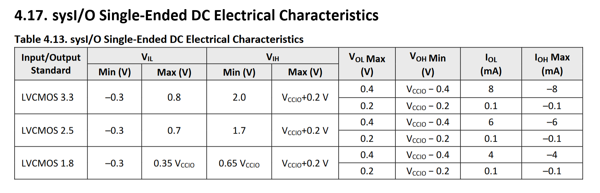
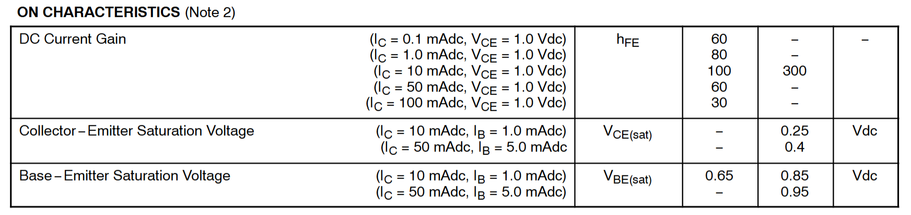
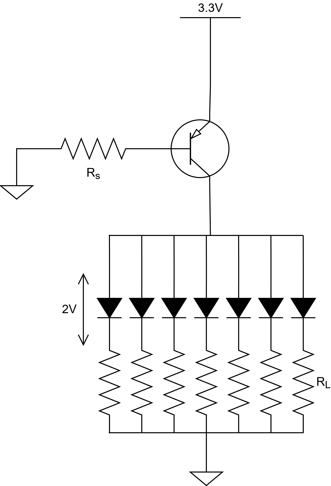
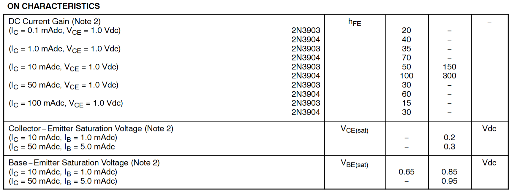
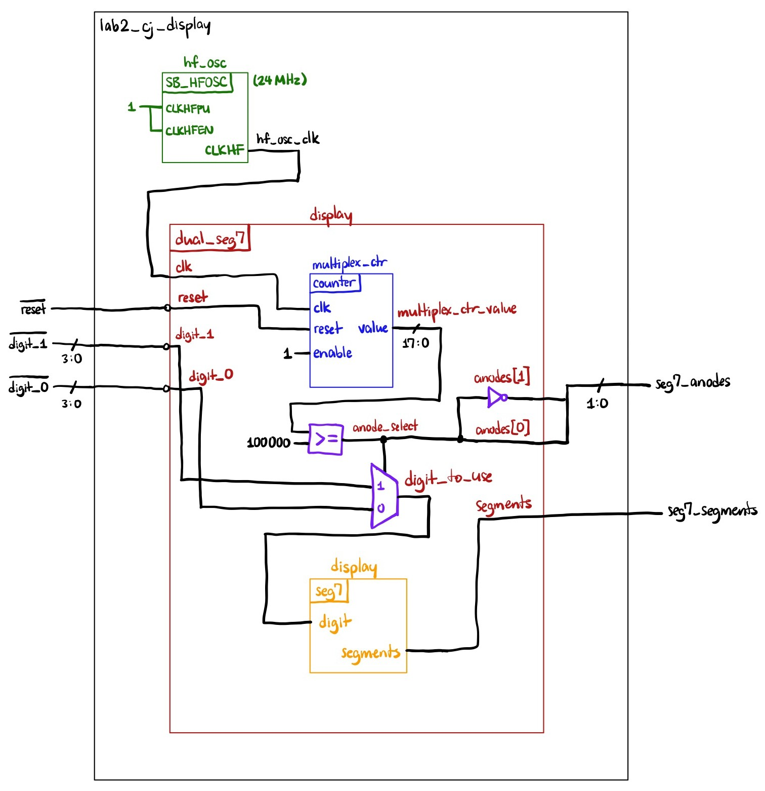
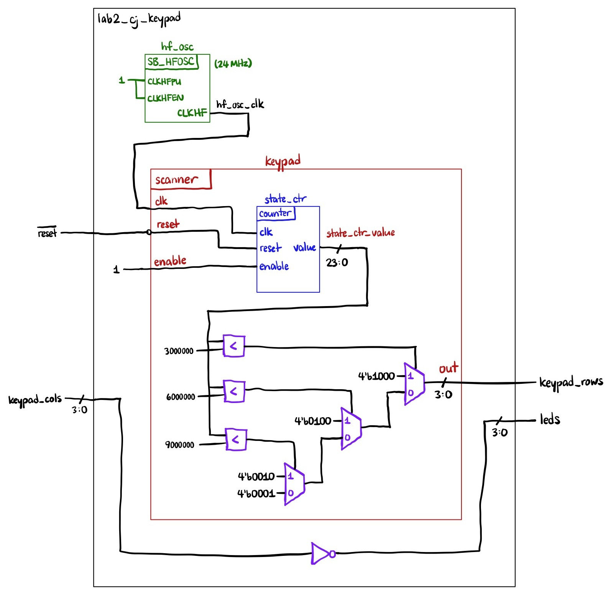
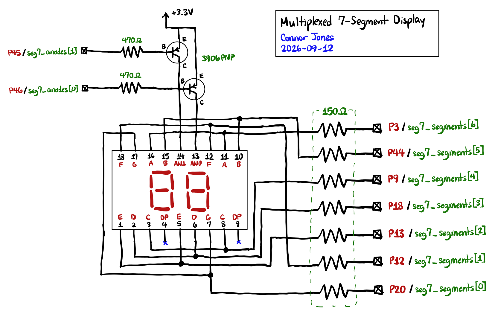
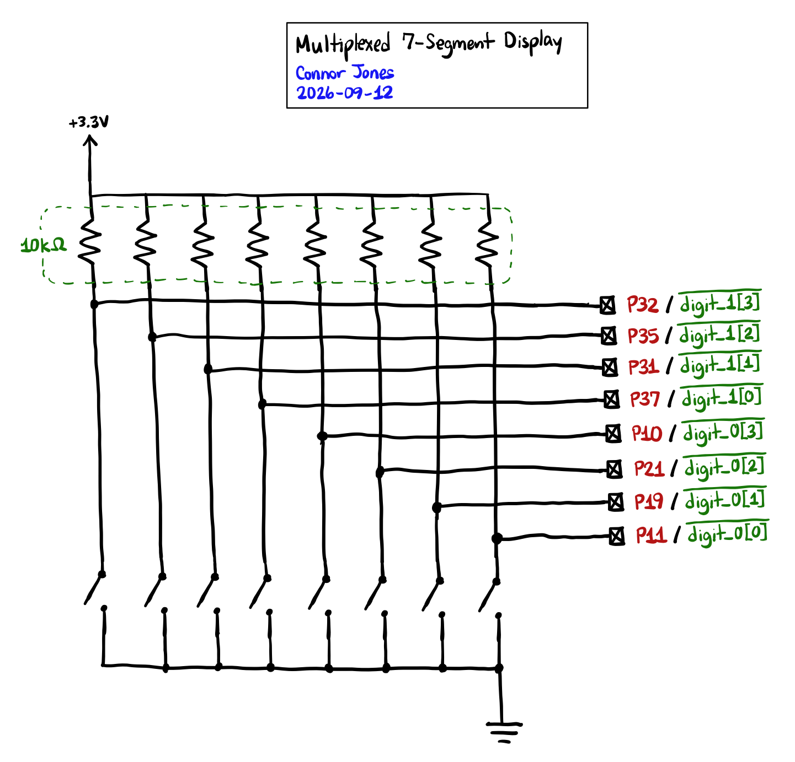
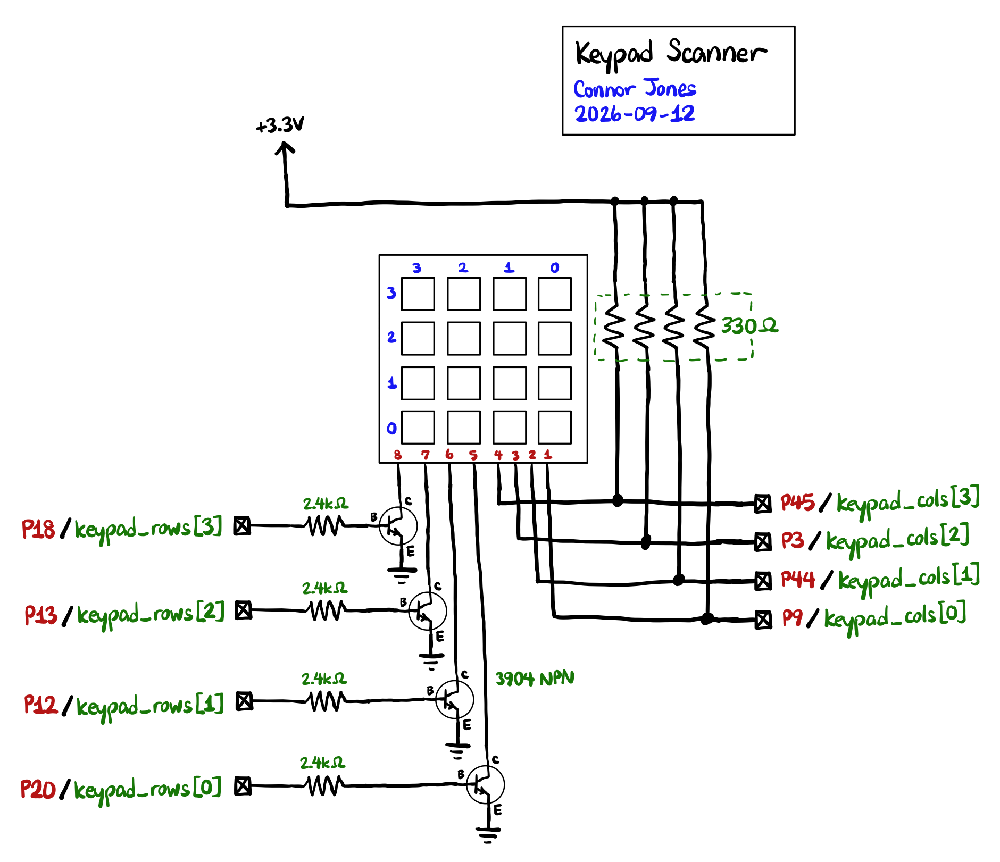

## Introduction

In this lab, I multiplexed a dual 7-segment display using the single 7-segment display module from Lab 1. I also designed and built a keypad scanning module capable of reading multiple simultaneous keypresses in preparation for Lab 3.

## Design and Calculations

In this lab, care had to be taken to ensure that current draw from the display did not exceed the maximum ratings of the FPGA. The table below taken from the datasheet indicates that the maximum current draw of the I/O pins is 8mA, whether sourcing or sinking current.



### Multiplexed 7-Segment Display

To drive the dual 7-segment display, 3906 PNP transistors were placed between +Vcc and the anodes of each digit, and current-limiting resistors were placed between the cathodes of each segment and the FPGA pins. Current-limiting resistors were also connected to the base pins of the transistors.



Since we're using the transistor as a switch, we'll assume it's in saturation. When the transistor is in saturation, $I_C$ = 50mA, and $I_B$ = 5mA, then $V_\mathrm{CE}$ = 0.4V and $V_\mathrm{BE}$ = 0.95V. We already know the forward voltage of the segments on the display is 2V. A basic schematic looks like:

{width=40% fig-align="center"}

::: {.callout-note collapse="true"}
## Spoiler: Click to show calculations
{.mb-0 width=80% fig-align="center"}

$R_s$ is a standard resistance value that can be left as-is. For $R_L$, 126 Ohms is not a standard resistance value, so we'll pick the closest value of 150 Ohms instead.
:::

We'll also need to multiplex the display at a suitable rate so that the digits neither flicker nor bleed together. A good frequency to target is 120Hz, which is high enough that the naked eye cannot perceive flickering while also being low enough to prevent bleeding. We'll need to set the `MAXCOUNT` value of the counter such that the display refreshes 120 times per second.

::: {.callout-note collapse="true"}
## Spoiler: Click to show calculations
{.mb-0 width=80% fig-align="center"}
:::

### Keypad

To scan the 4x4 keypad, we'll use an open-drain output to drive the rows of the keypad low so that we can detect multiple keypresses without any issue. The transistors are switching the low side of the load this time, so we'll need to use an NPN. The characteristics of the 3904 NPN transistor are shown in the table below.



When the transistor is in saturation, $I_C$ = 10mA, and $I_B$ = 1mA, then $V_\mathrm{CE}$ = 0.2V and $V_\mathrm{BE}$ = 0.85V. The schematic is like the one for the multiplexed 7-segment display, but with the transistor on the low side and the load replaced with a switch.

::: {.callout-note collapse="true"}
## Spoiler: Click to show calculations
{.mb-0 width=80% fig-align="center"}

$R_s$ is the series resistance connected to the base of the transistor and $R_p$ is the pullup resistor to Vcc. Neither calculated values were standard resistance values, so the closest ones were picked instead.
:::

The specifications say to target a blinking rate of 2 Hz, and because there are 4 states, each output must last 0.125 seconds. Thus, `SCAN_DELAY` should be $24 \mathrm{MHz} \cdot 0.125 \mathrm{s} = 3000000$.

## Technical Documentation

**Note:** The two different deliverables (7-segment display and keypad scanner) were demonstrated as separate modules for this lab because there were not enough FPGA pins to run both simultaneously.

### Block Diagrams

#### Multiplexed 7-Segment Display



The figure above shows the block diagram for the multiplexed 7-segment display. The multiplexing logic is contained in the `dual_seg7` module, which uses a counter to switch between displaying the different digits. When the counter is below half of its maximum count, a multiplexer feeds `digit_0` into the `digit_to_use` node and drives `anode[0]` high (PNP transistors are active low). When the counter is above half of its maximum count, the multiplexer selects `digit_1` instead and toggles the anodes so that `anode[1]` is driven high. The `seg7` module from Lab 1 encodes the selected digit as segments on a single digit 7-segment display.

---

#### Keypad Scanner



The figure above shows the block diagram for the keypad scanner circuit. The logic responsible for switching between the different outputs is implemented in the counter, comparison blocks, and muxes. When the counter is below 1/4 of its maximum count, the muxes select the first output. Otherwise, if the counter is between 1/4 and 2/4 of its maximum count, the muxes select the second output, and so on. The values read from the keypad columns are simply driven back out onto the LEDs (after being inverted since the inputs are active low).

### Schematics

#### Multiplexed 7-Segment Display





The figures above show the schematics of the circuit used to drive the dual 7-segment display. 3906 PNP transistors are used to switch current through the common anodes of each digit to avoid damaging the FPGA pins with excessive current. Each segment is connected through a current-limiting resistor to further regulate the current going into the I/O pins.

---

#### Keypad Scanner



The figure above shows the schematics of the circuit used to read the 4x4 matrix keypad. The setup uses an open-drain output with 3904 NPN transistors so that row pins are floating when not being interrogated. This allows multiple keypresses to be handled in the same column without causing any contention between different voltages.

## Results and Discussion

### Testbench Simulation

TODO

### Hardware

TODO

## Conclusion

In this lab, I successfully multiplexed a dual 7-segment display and built a scanner module to read inputs from a 4x4 membrane keypad.

Breakdown of time spent in lab:
- **Hardware and circuit design:** ~5 hours
- **Verilog:** ~2 hours
- **ENTIRE LAB WORKING IN HARDWARE AFTER 7 HOURS**
- **Documentation and calulcations:** ~5 hours
- **Lab writeup:** ~1 hour

## AI Prototype

Prompt 1:

> Write SystemVerilog HDL to time multiplex a single seven segment decoder (that decodes from four bits to a common anode seven segment display) to decode two sets of input bits and drive two sets of seven output bits.

::: {.callout-note collapse="true"}
## Spoiler: Click to show code

```sv
module dual_seven_segment #(
    parameter int CLK_FREQ_HZ = 12_000_000
) (
    input  logic       clk,
    input  logic       reset_n,

    input  logic [3:0] input_a,
    input  logic [3:0] input_b,

    output logic [6:0] segments_a,
    output logic [6:0] segments_b
);
    logic       select;
    logic [3:0] decoder_input;
    logic [6:0] decoder_output;

    // Multiplex the two inputs into the single decoder.
    always_comb begin
        case (select)
            1'b0: decoder_input = input_a;
            1'b1: decoder_input = input_b;
        endcase
    end

    // Only one physical decoder is instantiated.
    seven_segment_decoder decoder (
        .value    (decoder_input),
        .segments (decoder_output)
    );

    // Alternate between the two inputs and save each decoded result
    // into its respective output register.
    always_ff @(posedge clk or negedge reset_n) begin
        if (!reset_n) begin
            select     <= 1'b0;
            segments_a <= 7'b1111111;
            segments_b <= 7'b1111111;
        end
        else begin
            if (select == 1'b0)
                segments_a <= decoder_output;
            else
                segments_b <= decoder_output;

            select <= ~select;
        end
    end
endmodule
```

```sv
module seven_segment_decoder (
    input  logic [3:0] value,
    output logic [6:0] segments
);
    // Segment ordering:
    //
    //       a
    //      ---
    //   f |   | b
    //      -g-
    //   e |   | c
    //      ---
    //       d
    //
    // segments = {a, b, c, d, e, f, g}
    //
    // Common-anode display:
    //     0 = segment ON
    //     1 = segment OFF

    always_comb begin
        case (value)
            4'h0: segments = 7'b0000001;
            4'h1: segments = 7'b1001111;
            4'h2: segments = 7'b0010010;
            4'h3: segments = 7'b0000110;
            4'h4: segments = 7'b1001100;
            4'h5: segments = 7'b0100100;
            4'h6: segments = 7'b0100000;
            4'h7: segments = 7'b0001111;
            4'h8: segments = 7'b0000000;
            4'h9: segments = 7'b0000100;
            4'hA: segments = 7'b0001000;
            4'hB: segments = 7'b1100000;
            4'hC: segments = 7'b0110001;
            4'hD: segments = 7'b1000010;
            4'hE: segments = 7'b0110000;
            4'hF: segments = 7'b0111000;
            default:
                segments = 7'b1111111;
        endcase
    end
endmodule
```
:::

Some notes:
- After looking through the code, the output seems reasonable. It uses two registers (`segments_a` and `segments_b`) to store the decoder outputs for each digit, and alternates between updating each one on every clock cycle.
- I probably would have simplified the `always_comb` block for setting `decoder_input` into an `assign` statement with a ternary operator.
- There is an unused parameter `CLK_FREQ_HZ` and I'm not sure why it was included in the generated code. ChatGPT acknowledges this parameter is unnecessary and can be removed.
- The code compiles and synthesizes successfully.

---

Prompt 2:

> Write SystemVerilog HDL to time multiplex a single seven segment decoder (that decodes from four bits to a common anode seven segment display) to decode two sets of input bits and drive two sets of seven output bits. Use the seven segment decoder and oscillator provided in the attached files.

I attached my 7-segment module from Lab 1 as context for the prompt.

::: {.callout-note collapse="true"}
## Spoiler: Click to show code

```sv
module seg7_mux2 (
    input  logic       clk,
    input  logic       rst_n,

    input  logic [3:0] digit0,
    input  logic [3:0] digit1,

    output logic [6:0] segments0,
    output logic [6:0] segments1
);
    logic       select;
    logic [3:0] mux_digit;
    logic [6:0] decoded_segments;

    // Alternate between the two displays on each clock cycle.
    // Asynchronous active-low reset selects display 0 initially.
    always_ff @(posedge clk or negedge rst_n) begin
        if (!rst_n)
            select <= 1'b0;
        else
            select <= ~select;
    end

    // Multiplex the two 4-bit inputs into the single decoder.
    always_comb begin
        if (select)
            mux_digit = digit1;
        else
            mux_digit = digit0;
    end

    // Only one seven-segment decoder is instantiated.
    seg7 decoder (
        .digit    (mux_digit),
        .segments (decoded_segments)
    );

    // Route the decoder output to the selected display.
    // 7'b1111111 turns every segment OFF on a common-anode display.
    always_comb begin
        segments0 = 7'b1111111;
        segments1 = 7'b1111111;

        if (select)
            segments1 = decoded_segments;
        else
            segments0 = decoded_segments;
    end
endmodule
```
:::

Some notes:
- The code generated from this prompt is far more questionable from the first.