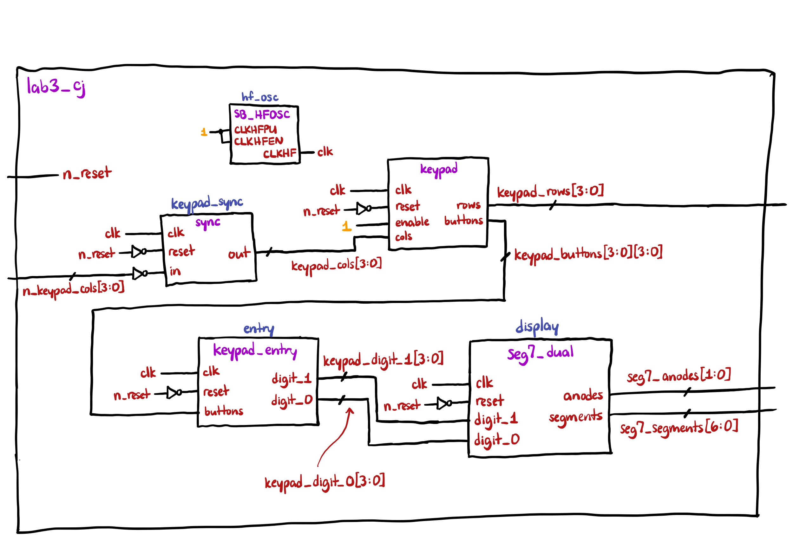
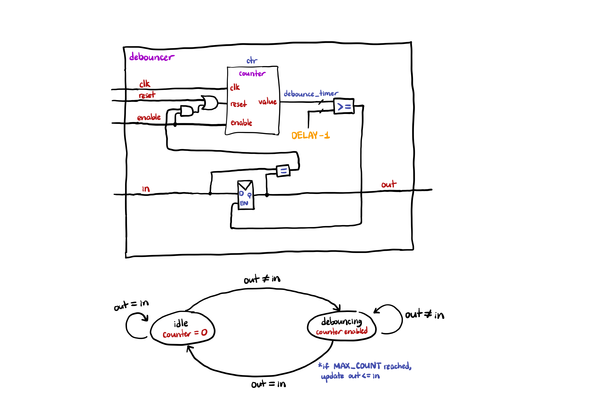
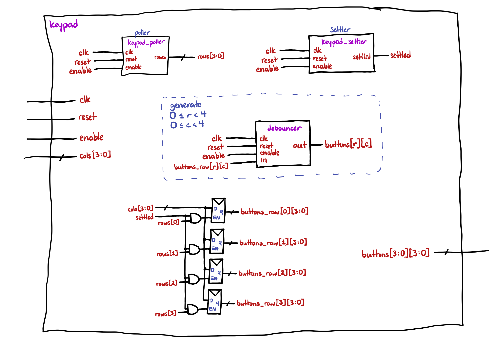
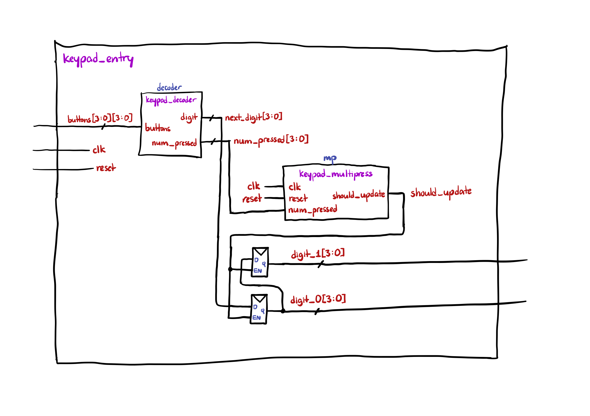
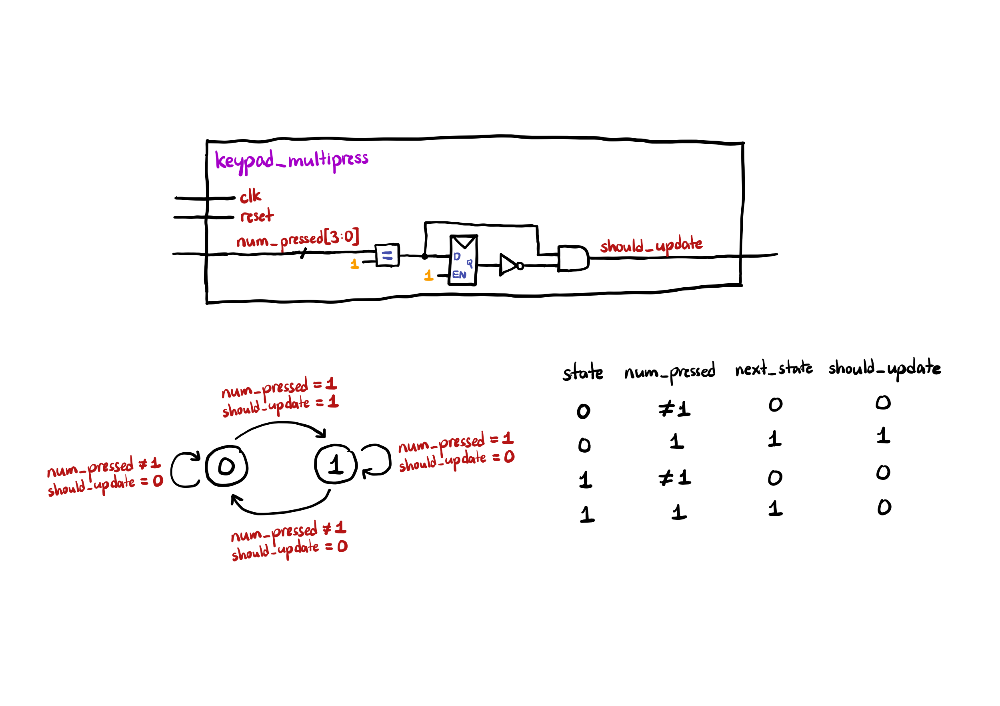
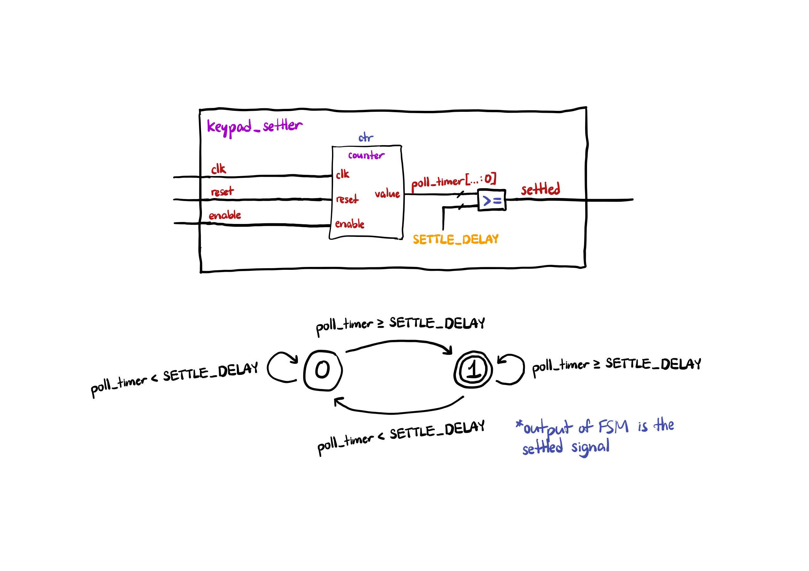
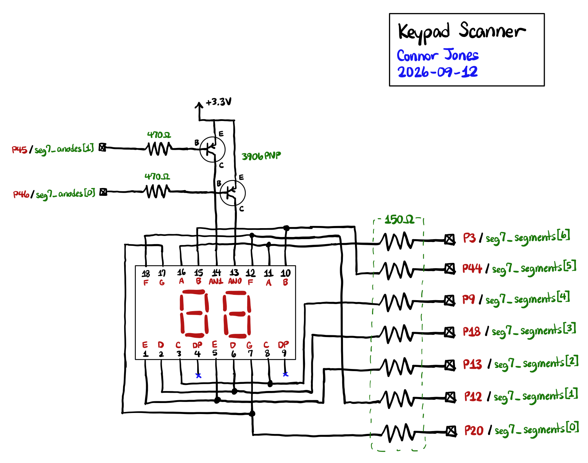
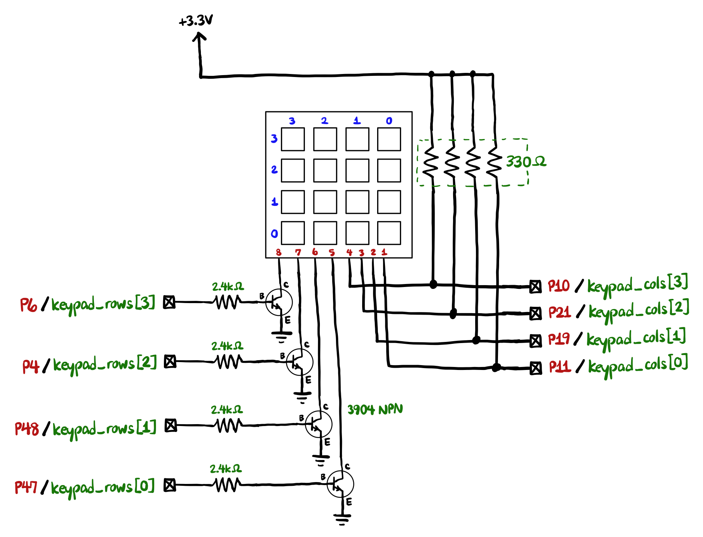
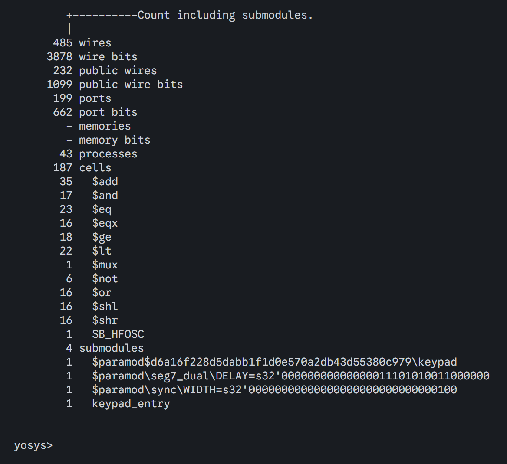

## Introduction

In this lab, I wired up a keypad to an FPGA and displayed the last two button presses on a dual 7-segment display.


## Module Design

[The code for this lab can be found at this repository.](https://github.com/conjoneshmc/e155-labs/tree/main/lab-3)

When designing my approach to this lab, I split my work up across a number of different submodules. In total, I had 12 different modules, although some were re-used from previous labs. This section describes the design approaches I took and the structure of different modules and how they communicate.

### Switch Debouncing

My strategy for switch debouncing was relatively simple: require any changes in an input signal to be held continuously for a certain number of clock cycles before accepting it as the new output. I attached the output of the debouncer to a register, and tied a comparison for equality between the input and output to the reset pin of a counter. That way, when the input matches the output, the counter is held at 0, otherwise the counter starts to increment. If the input is a bounce, it simply resets the counter back to 0. Otherwise, when the maximum count of the counter is reached, the register is enabled and the output gets the value of the input. This also resets the counter back to 0 and holds it there until any further changes are detected.

To avoid any weird shenanigans with multi-touches on the keypad, I created an individual debouncer for each button on the keypad using a `generate` block in SystemVerilog. This was definitely not the most hardware-efficient method available, but it had a massive advantage of making the logic easier to reason through. By putting each button on its own debouncing timer, the keypad polling module can run independently of any button presses. That is, the keypad poller can simply rotate outputs at a fixed delay without stopping at a row when we detect a button press, because even if we start scanning another row while a button is being held, the debouncer for that button will still "remember" the button press.

Another advantage of this debouncing strategy is that it debounces keypad presses as well as keypad releases. This avoids a situation where a button is being held down but mechanical switch bounce causes the program to mistakenly register the key being released and pressed down again.

### FSM Design Strategy

The design and partioning of the FSMs used in this lab is very modular. Each module is responsible for a very specific task and I tried my best to avoid "meshing" two tasks into one module. For example, the module for detecting button presses on the keypad and the module for remembering the last two button presses are separate. This design makes the components built in this lab extremely reusable and adaptable for different use-cases (using my design, it would not be very difficult to modify for a 4-digit display instead of a dual display). This of course, comes at the cost of additional hardware, since there are many additional internal signals present used for submodule connections that could have been optimized away if I put many different functions into the same module.

The hierarchy of my design is as follows:

- `lab3_cj`: The top-level module, which takes in a reset and keypad column pins as inputs, and outputs the keypad row drivers and dual 7-segment display anodes and cathodes. It instantiates an internal clock at 24 MHz and contains the following submodules:
  - `sync`: Simply used to synchronize the keypad column inputs before passing them to other modules.
  - `keypad`: The module responsible for managing the keypad state, like what buttons are being pressed and what row pins should be driven. It accepts `cols[3:0]` as an input, drives `rows[3:0]`, and outputs `buttons[3:0][3:0]`, which is a 2D-array containing the pressed state for all 16 buttons on the keypad. It accepts the following parameter: `POLL_DELAY` (how many clock cycles in between each row scan), `SETTLE_DELAY` (how long to ignore the column inputs right after changing rows, this was needed to fix some issues with my debouncer as explained below), and `DEBOUNCE_DELAY`, which is the debounce time for each keypad button. This module contained the following submodules:
    - `keypad_poller`: Identical to the `scanner` module from Lab 2, it just rotates between pulling each of the row pins low every `POLL_DELAY` cycles.
    - `keypad_settler`: This was created to solve an issue I had with polling the rows of the keypad too fast. When I first wrote my keypad module, it didn't respond to any button presses. If I increased the polling delay, the keypad would start responding, although much slower. If I decreased the polling delay but held two buttons in the same column (e.g. a `1` and a `4`), the keypad would register a button press for `1` only. Due to these observations, I reasoned that there must be a timing issue with the column pins during a row change that was messing with debouncing timers on each button, and maybe there was some latency between switching rows and actually seeing new values change on the column pins. Therefore, I created this module, which simply instructs the keypad to ignore the column pins entirely for a certain number of clock cycles after each row change. After implementing this module, the keypad worked normally.
  - `keypad_entry`: This module is responsible for keeping of the last two digits pressed on the keypad. It accepts as input the `buttons[3:0][3:0]` signal from the `keypad` module, and outputs `digit_1[3:0]` and `digit_0[3:0]`. It contains the following submodules:
    - `keypad_decoder`: Combinational-logic only module that maps keypad rows and columns to hex digits. It also counts the number of buttons being held, for use in the next module.
    - `keypad_multipress`: A simple state machine containing all the logic for handling multiple button presses, and instructs the `keypad_entry` module when to actually update the display. It accepts the `num_pressed[3:0]` signal from the `keypad_decoder` module, and outputs `should_update` whenever transitioning from a state of no button presses or multi-button presses to a state of single button press.
  - `seg7_dual`: Simply takes the two hex digits from the output of the `keypad_entry` module and drives the dual 7-segment display.

Design tradeoffs:

- The keypad is very modular, since it outputs what buttons are being held at any given time, not just the last two digits pressed. This means it could be used in any other scenario where we need to read arbitrary button presses.
- Because of the modularity, the logic contained within each module is relatively simple, and it is easy to trace how data flows between different modules. We don't need to do any weird state logic for the scanner module where we have to temporarily stop scanning and wait for a button press to finish.
- The keypad module is also extremely hardware inefficient. It needs two copies of 4x4 bit arrays to store the un-debounced and debounced button states, as well as generating _16 copies_ of the debouncer module, which adds even more hardware usage. I probably could've changed the design to only require 4 debouncers, but it would require the `POLL_DELAY` to be slower than the `DEBOUNCE_DELAY` and might make the keypad less responsive.


## Block Diagrams

### Top-Level



---

### Debouncer



---

### Keypad



---

### Keypad Entry



---

### Keypad Multipress Handler



---

### Keypad Settler




## Schematics






## Testbenches & Simulation

### Yosys Synthesis Report



The synthesis report from `yosys` (the open-source synthesizer I used) reports no latch cells or tri-state buffers.

### Top-Level

Here is the top-level testbench responsible for verifying all the connections between submodules. Note that some of the timing parameters were changed for the testbench because many were on the order of tens of thousands of clock cycles, which would make the waveforms unreadable.


This testbench shows that:

- `clk` is always connected to the `clk` ports of each submodule (`sync`, `keypad`, `keypad_entry`, `seg7_dual`)
- The `keypad_cols` and `keypad_rows` signals are properly connected to the `keypad` module
  - Note that `keypad_cols` (internal signal) lags behind `n_keypad_cols` (top-level-input) because it has to go through the synchronizer first, so any updates are always a couple clock cycles late
- The `keypad_buttons` signal is properly connected to the `buttons` input inside of the `keypad_entry` module
- The `digit_1` and `digit_0` signals are properly connected between the `keypad_entry` and `seg7_dual` modules
- The `segments` and `anodes` outputs of the `seg7_dual` module are properly connected to their top-level outputs

### Debouncer

Here are the waveforms for the `debouncer` module. This is responsible for filtering out switch bounce from keypad presses by requiring a change in the input to be held for a continuous number of clock cycles before updating the output.


This waveform demonstrates the basic functionality of the debouncer. When `in` changes, `out` doesn't follow until the debounce delay has elapsed. In this case, the delay is 14 clock cycles.


This waveform demonstrates correct functionality even when an input changes right on top of a rising clock signal.


This waveform demonstrates the reset functionality.


This waveform demonstrates correct functionality in response to a simulated mechanical switch bounce. Inputs change at different times relative to the clock signal, but the output doesn't go high because the debouncer rejects the changes as noise.


This waveform demonstrates the enable functionality. When the debouncer is disabled, it simply maintains its output while ignoring any changes to the input.

### Keypad

Here are the waveforms:


### Keypad Decoder

Here are the waveforms for the `keypad_decoder` module. This module only consists of combinational logic to map keypad button locations to hexadecimal digits. It also counts the number of buttons being pressed.


These waveforms exercise all possible 16 branches of the combinational logic (one for each button). It also tests a couple cases involving different numbers of buttons being pressed.

### Keypad Entry

Here are the waveforms for the `keypad_entry` module. This module is responsible for keeping track of the last two digits entered on the keypad.


This waveform demonstrates basic functionality of the module:

- At 30ns, the module updates the rightmost digit to a `3` in response to the corresponding button being pressed
- At 35ns, the button `B` is held down in addition to `3`. The module rejects this additional keypress as per the specs
- At 55ns, the button `3` is released. This causes the keypad to transition from a multi-press state to a single-press state, which should register an additional keypress in accordance with the specs
- At 70ns, the display updates with `B` as the rightmost digit and moves the `3` over to the leftmost digit


This waveform shows the module properly keeping track of the two most recently entered digits on the keypad, with the most recent digit appearing on the right (`digit_0`).


This waveform demonstrates the reset functionality.

### Keypad Multipress Handler

Here are the waveforms for the `keypad_multipress` module. This module is responsible for keeping track of how many buttons are being pressed and telling the `keypad_entry` module when to update.


This waveform demonstrates the key state transitions of the module:

- going from 0 presses to 1 press
- going from 1 press to multiple presses
- going from multiple presses to 1 press
- going from 1 press to 0 presses

The module only outputs `should_update` when entering the 1-press state from a 0-press or multi-press condition.

### Keypad Settler

Here are the waveforms for the `keypad_settler` module. This module tells the `keypad` module not to look at the column inputs right after a row change, because I was running into issues polling the keypad rows too fast.


In this case, the output goes low for 3 clock cycles and then high for 7 clock cycles. The exact period can be configured to line up with the keypad's `POLL_DELAY`.

### Synchronizer

This module synchronizes asynchronous inputs, at the cost of introducing two clock cycles of delay.


### Already Verified Modules

- `counter`: verified in Lab 1
- `keypad_poller`: same as the scanner module from Lab 2


## Conclusion

After testing the design in hardware, it meets all the specifications, including all the edge cases involving multiple button presses.

**Time spent:** 13 hours

The lab was working entirely in hardware after about **5 hours**.

## AI Prototype

Prompt 1:

> Target device: Lattice iCE40 UP5K FPGA with internal high-speed oscillator (~20 MHz).
>
> Write synthesizable SystemVerilog to scan a 4x4 matrix keypad and display the last two hex keys pressed on a dual 7‑segment display. Implement:
>
> - A clock divider that derives a scan clock on the order of 100–200 Hz from the internal oscillator.
> - A keypad scanning controller that iterates one active‑low column at a time and samples active‑low rows, registering at most one key per press (debounce‑by‑design), ignoring additional presses while any key is held, and allowing a new registration only after release.
> - A top level that updates two hex digits (older and most recent) when a new key is registered and drives a time‑multiplexed two‑digit 7‑segment display without visible flicker and with balanced brightness.
>
> Use idiomatic SystemVerilog (e.g., logic, always_ff, enumerated states for FSMs). Provide clean module boundaries and keep all state synchronous. Include brief comments explaining the design choices.

::: {.callout-note collapse="true"}
## Spoiler: Click to show code

```sv
// All state uses the 24 MHz oscillator clock. Hold reset high during
// startup, then deassert it synchronously to the oscillator clock.

module periodic_enable #(
    parameter int unsigned CLOCK_HZ = 24_000_000,
    parameter int unsigned RATE_HZ  = 200
) (
    input  logic clk,
    input  logic reset,
    output logic tick
);
    localparam int unsigned COUNT_MAX = CLOCK_HZ / RATE_HZ;
    localparam int unsigned WIDTH = $clog2(COUNT_MAX);
    logic [WIDTH-1:0] count;

    always_ff @(posedge clk) begin
        if (reset) begin
            count <= '0;
            tick  <= 1'b0;
        end else if (count == COUNT_MAX - 1) begin
            count <= '0;
            tick  <= 1'b1;
        end else begin
            count <= count + 1'b1;
            tick  <= 1'b0;
        end
    end
endmodule

module keypad_scanner (
    input  logic       clk,
    input  logic       reset,
    input  logic       scan_tick,
    input  logic [3:0] rows_n,
    output logic [3:0] cols_n,
    output logic [3:0] key,
    output logic       key_valid
);
    typedef enum logic [1:0] {
        WAIT_PRESS, CONFIRM_PRESS, WAIT_RELEASE, CONFIRM_RELEASE
    } state_t;

    state_t state;
    logic [1:0] column;
    logic [3:0] rows_meta, rows_sync;
    logic       frame_any;
    logic [3:0] frame_key, candidate;
    logic       sample_any;
    logic [3:0] sample_key;

    // Synchronize the asynchronous keypad inputs before sampling them.
    always_ff @(posedge clk) begin
        if (reset) begin
            rows_meta <= 4'hF;
            rows_sync <= 4'hF;
        end else begin
            rows_meta <= rows_n;
            rows_sync <= rows_meta;
        end
    end

    // Exactly one column is low. It remains selected for 5 ms before
    // its rows are sampled and the next column is selected.
    always_comb begin
        cols_n = 4'hF;
        cols_n[column] = 1'b0;

        sample_any = (rows_sync != 4'hF);
        sample_key = {column, 2'b00};
        if      (!rows_sync[0]) sample_key[1:0] = 2'd0;
        else if (!rows_sync[1]) sample_key[1:0] = 2'd1;
        else if (!rows_sync[2]) sample_key[1:0] = 2'd2;
        else                    sample_key[1:0] = 2'd3;
    end

    always_ff @(posedge clk) begin
        if (reset) begin
            column    <= 2'd0;
            frame_any <= 1'b0;
            frame_key <= 4'd0;
            candidate <= 4'd0;
            state     <= WAIT_PRESS;
            key       <= 4'd0;
            key_valid <= 1'b0;
        end else begin
            key_valid <= 1'b0; // One system-clock pulse per accepted key.

            if (scan_tick) begin
                if (sample_any && !frame_any)
                    frame_key <= sample_key;

                if (column == 2'd3) begin
                    // Current sample completes the four-column frame.
                    case (state)
                        WAIT_PRESS: begin
                            if (frame_any || sample_any) begin
                                candidate <= frame_any ? frame_key : sample_key;
                                state     <= CONFIRM_PRESS;
                            end
                        end

                        CONFIRM_PRESS: begin
                            if (!(frame_any || sample_any)) begin
                                state <= WAIT_PRESS;
                            end else if ((frame_any ? frame_key : sample_key)
                                         == candidate) begin
                                key       <= candidate;
                                key_valid <= 1'b1;
                                state     <= WAIT_RELEASE;
                            end else begin
                                candidate <= frame_any ? frame_key : sample_key;
                            end
                        end

                        WAIT_RELEASE: begin
                            if (!(frame_any || sample_any))
                                state <= CONFIRM_RELEASE;
                        end

                        CONFIRM_RELEASE: begin
                            if (frame_any || sample_any)
                                state <= WAIT_RELEASE;
                            else
                                state <= WAIT_PRESS;
                        end

                        default: state <= WAIT_PRESS;
                    endcase

                    frame_any <= 1'b0;
                    column    <= 2'd0;
                end else begin
                    frame_any <= frame_any || sample_any;
                    column    <= column + 2'd1;
                end
            end
        end
    end
endmodule

module hex_seven_segment (
    input  logic [3:0] hex,
    output logic [6:0] segments_n  // {a,b,c,d,e,f,g}, active low
);
    always_comb begin
        case (hex)
            4'h0: segments_n = 7'b0000001;
            4'h1: segments_n = 7'b1001111;
            4'h2: segments_n = 7'b0010010;
            4'h3: segments_n = 7'b0000110;
            4'h4: segments_n = 7'b1001100;
            4'h5: segments_n = 7'b0100100;
            4'h6: segments_n = 7'b0100000;
            4'h7: segments_n = 7'b0001111;
            4'h8: segments_n = 7'b0000000;
            4'h9: segments_n = 7'b0000100;
            4'hA: segments_n = 7'b0001000;
            4'hB: segments_n = 7'b1100000;
            4'hC: segments_n = 7'b0110001;
            4'hD: segments_n = 7'b1000010;
            4'hE: segments_n = 7'b0110000;
            default: segments_n = 7'b0111000; // F
        endcase
    end
endmodule

module keypad_hex_display (
    input  logic       reset,      // Active-high synchronous reset
    input  logic [3:0] rows_n,     // Active-low; external pull-ups required
    output logic [3:0] cols_n,
    output logic [6:0] segments_n, // Shared, active-low segment outputs
    output logic [1:0] digit_n     // {older, newest}, active low
);
    logic clk;
    logic scan_tick, display_tick;
    logic [3:0] key, older, newest, displayed_hex;
    logic key_valid, select_newest;

    SB_HFOSC #(.CLKHF_DIV("0b01")) oscillator (
        .CLKHFPU(1'b1),
        .CLKHFEN(1'b1),
        .CLKHF(clk)
    );

    periodic_enable #(.RATE_HZ(200)) scan_rate (
        .clk(clk), .reset(reset), .tick(scan_tick)
    );

    periodic_enable #(.RATE_HZ(1_000)) display_rate (
        .clk(clk), .reset(reset), .tick(display_tick)
    );

    keypad_scanner scanner (
        .clk(clk), .reset(reset), .scan_tick(scan_tick),
        .rows_n(rows_n), .cols_n(cols_n),
        .key(key), .key_valid(key_valid)
    );

    always_ff @(posedge clk) begin
        if (reset) begin
            older         <= 4'h0;
            newest        <= 4'h0;
            select_newest <= 1'b0;
        end else begin
            if (key_valid) begin
                older  <= newest;
                newest <= key;
            end
            if (display_tick)
                select_newest <= ~select_newest;
        end
    end

    // Equal 1 ms slots give each digit a 500 Hz refresh rate and 50% duty.
    assign displayed_hex = select_newest ? newest : older;
    assign digit_n       = select_newest ? 2'b10 : 2'b01;

    hex_seven_segment decoder (
        .hex(displayed_hex), .segments_n(segments_n)
    );
endmodule
```
:::

I found the design somewhat obscure and hard to understand. All of the keypad logic is placed into one giant FSM with lots of internal signals. There appear to be four states that involve confirming or waiting for button presses and releases. The next state logic is very unclear to me, there are lots of signals whose purposes I am not sure of, and all of it is wrangled into a convoluted case statement. The LLM did not really provide an explanation of how the design worked. If I were to design this on my own, I would have modularized the design more.

---

Prompt 2:

> Target device: Lattice iCE40 UP5K FPGA.
>
> Overall Goal: Write SystemVerilog to scan a 4x4 matrix keypad and display the last two hex keys pressed on a dual 7 segment display.
>
> Current Goal: Write a synthesizable SystemVerilog module that produces a one‑shot registration signal for the keypad system. Behavior:
>
> - When a key press is first detected, capture the current key code and assert a single‑cycle “new key” pulse.
> - While any key remains pressed, do not accept additional keys.
> - Only after keys are released should a subsequent press be recognized.
> - This should handle debouncing of the keys.
>
> Implement as a small synchronous FSM with enumerated states and glitch‑free outputs. Keep names and interfaces reasonable; do not assume any hidden modules beyond what you define here.
>
> Write a synthesizable SystemVerilog module that cycles through keypad columns (active‑low, one at a time) and samples rows (active‑low) to detect a single key at a time. Behavior:
>
> - Iterate columns at a suitable scan rate derived from the divided clock and sample rows.
> - When a key is detected, report a stable key code consistent with a standard 4x4 keypad layout and maintain it while the key remains pressed.
> - Provide a boolean signal indicating whether any key is currently pressed.
>
> Use clean state encoding and synchronous logic; avoid combinational feedback and latches.
>
> Write a top‑level SystemVerilog module that instantiates the scanner and one‑shot modules, shifts the last two keys (older ← most recent; most recent ← new), and drives a multiplexed two‑digit seven‑segment display. Requirements:
>
> - Update the displayed digits only when a new key is registered.
> - Ensure equal apparent brightness and no visible flicker.
> - Keep all logic synthesizable and synchronous; use idiomatic SystemVerilog constructs.
>
> Provide any small clock‑enable or divider logic you need. You can also assume that a sevenSegment module exists that takes a 4 bit input and outputs the 7 segments.

::: {.callout-note collapse="true"}
## Spoiler: Click to show code

```sv
module key_register #(
    // Number of consecutive clock cycles for which the press/release
    // condition must remain stable before it is accepted.
    parameter int unsigned DEBOUNCE_CYCLES = 4
) (
    input  logic       clk,
    input  logic       rst_n,

    // Inputs from keypad scanner / decoder
    input  logic       key_pressed,   // 1 when any key is detected
    input  logic [3:0] key_code,      // decoded hexadecimal key

    // Registered output
    output logic       new_key,       // one-clock pulse for each accepted press
    output logic [3:0] registered_key
);

    typedef enum logic [1:0] {
        IDLE,               // waiting for a key press
        DEBOUNCE_PRESS,     // verifying that press is stable
        HELD,               // key accepted; wait for release
        DEBOUNCE_RELEASE    // verifying that release is stable
    } state_t;

    state_t state;

    localparam int unsigned COUNT_WIDTH =
        (DEBOUNCE_CYCLES <= 1) ? 1 : $clog2(DEBOUNCE_CYCLES);

    logic [COUNT_WIDTH-1:0] debounce_count;
    logic [3:0] candidate_key;


    always_ff @(posedge clk or negedge rst_n) begin
        if (!rst_n) begin
            state          <= IDLE;
            debounce_count <= '0;
            candidate_key  <= '0;
            registered_key <= '0;
            new_key        <= 1'b0;
        end
        else begin
            // Default assignment makes new_key a one-clock pulse.
            new_key <= 1'b0;

            case (state)

                // ---------------------------------------------------------
                // Wait for the beginning of a key press.
                // ---------------------------------------------------------
                IDLE: begin
                    debounce_count <= '0;

                    if (key_pressed) begin
                        // Remember the key seen at the start of the press.
                        candidate_key <= key_code;

                        if (DEBOUNCE_CYCLES <= 1) begin
                            registered_key <= key_code;
                            new_key        <= 1'b1;
                            state          <= HELD;
                        end
                        else begin
                            state <= DEBOUNCE_PRESS;
                        end
                    end
                end


                // ---------------------------------------------------------
                // Require the key to remain pressed long enough to reject
                // contact bounce.
                // ---------------------------------------------------------
                DEBOUNCE_PRESS: begin
                    if (!key_pressed) begin
                        // Press disappeared before debounce interval ended.
                        debounce_count <= '0;
                        state          <= IDLE;
                    end
                    else if (debounce_count == DEBOUNCE_CYCLES - 2) begin
                        registered_key <= candidate_key;
                        new_key        <= 1'b1;

                        debounce_count <= '0;
                        state          <= HELD;
                    end
                    else begin
                        debounce_count <= debounce_count + 1'b1;
                    end
                end


                // ---------------------------------------------------------
                // A key has already been registered. Ignore all key-code
                // changes until every key has been released.
                // ---------------------------------------------------------
                HELD: begin
                    debounce_count <= '0;

                    if (!key_pressed) begin
                        if (DEBOUNCE_CYCLES <= 1) begin
                            state <= IDLE;
                        end
                        else begin
                            state <= DEBOUNCE_RELEASE;
                        end
                    end
                end


                // ---------------------------------------------------------
                // Require release to remain stable before re-arming.
                // This prevents release bounce from producing another key.
                // ---------------------------------------------------------
                DEBOUNCE_RELEASE: begin
                    if (key_pressed) begin
                        // Still the same physical press, or release bounce.
                        debounce_count <= '0;
                        state          <= HELD;
                    end
                    else if (debounce_count == DEBOUNCE_CYCLES - 2) begin
                        debounce_count <= '0;
                        state          <= IDLE;
                    end
                    else begin
                        debounce_count <= debounce_count + 1'b1;
                    end
                end


                default: begin
                    state          <= IDLE;
                    debounce_count <= '0;
                end

            endcase
        end
    end

endmodule
```
:::

The design is more modular than the monolithic prompt, but it is still quite convoluted to me. For example, the debouncer module is much longer than mine and has four states, whereas mine only has two. It is also written specifically for the keypad module, while I designed min to be more of a general-purpose debouncer that could be used anywhere. In the future, I think I would talk through the approach with an LLM first before having it generate any code, that way I will be able to understand the design better.