## Introduction

## Testbenches

### Top-Level

Here is the top-level testbench responsible for verifying all the connections between submodules. Note that some of the timing parameters were changed for the testbench because many were on the order of tens of thousands of clock cycles, which would make the waveforms unreadable.

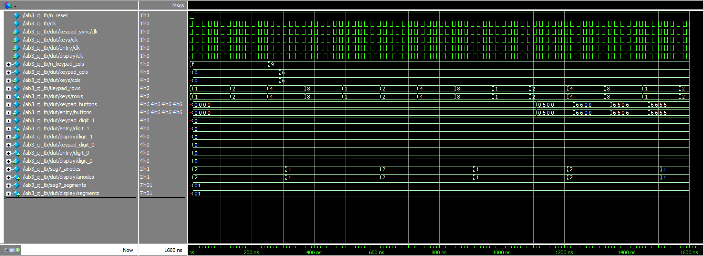

This testbench shows that:

- `clk` is always connected to the `clk` ports of each submodule (`sync`, `keypad`, `keypad_entry`, `seg7_dual`)
- The `keypad_cols` and `keypad_rows` signals are properly connected to the `keypad` module
  - Note that `keypad_cols` (internal signal) lags behind `n_keypad_cols` (top-level-input) because it has to go through the synchronizer first, so any updates are always a couple clock cycles late
- The `keypad_buttons` signal is properly connected to the `buttons` input inside of the `keypad_entry` module
- The `digit_1` and `digit_0` signals are properly connected between the `keypad_entry` and `seg7_dual` modules
- The `segments` and `anodes` outputs of the `seg7_dual` module are properly connected to their top-level outputs

### Counter

Already verified in Lab 1.

### Debouncer

Here are the waveforms for the `debouncer` module. This is responsible for filtering out switch bounce from keypad presses by requiring a change in the input to be held for a continuous number of clock cycles before updating the output.

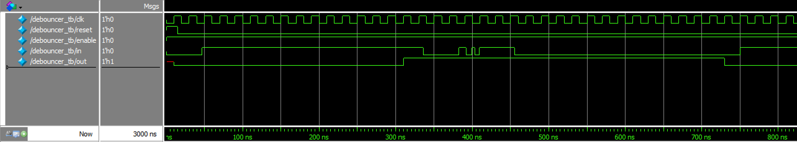

This waveform demonstrates the basic functionality of the debouncer. When `in` changes, `out` doesn't follow until the debounce delay has elapsed. In this case, the delay is 14 clock cycles.

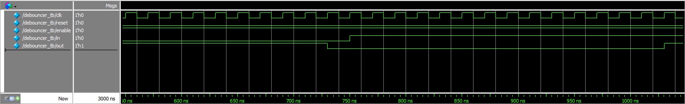

This waveform demonstrates correct functionality even when an input changes right on top of a rising clock signal.

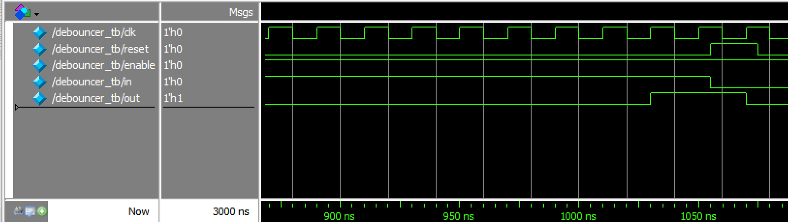

This waveform demonstrates the reset functionality.

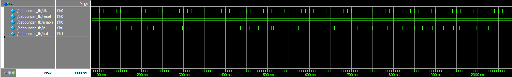

This waveform demonstrates correct functionality in response to a simulated mechanical switch bounce. Inputs change at different times relative to the clock signal, but the output doesn't go high because the debouncer rejects the changes as noise.

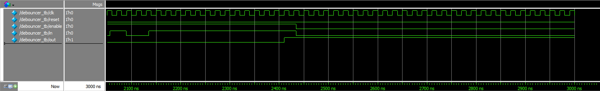

This waveform demonstrates the enable functionality. When the debouncer is disabled, it simply maintains its output while ignoring any changes to the input.

### Keypad

Here are the waveforms:

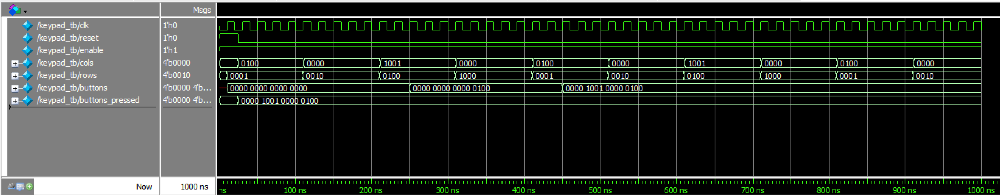

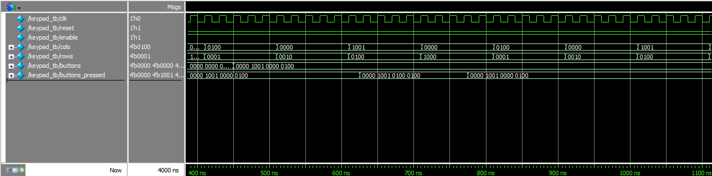

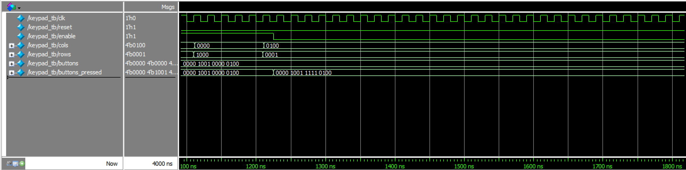

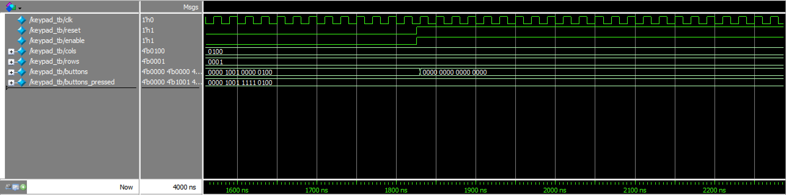

### Keypad Decoder

Here are the waveforms for the `keypad_decoder` module. This module only consists of combinational logic to map keypad button locations to hexadecimal digits. It also counts the number of buttons being pressed.

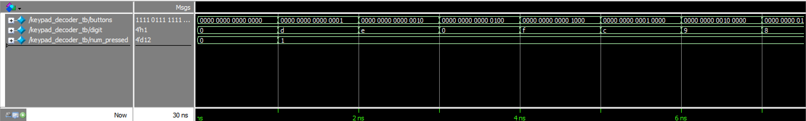

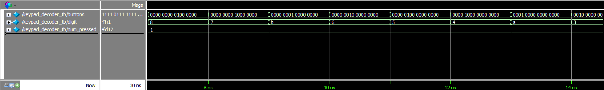

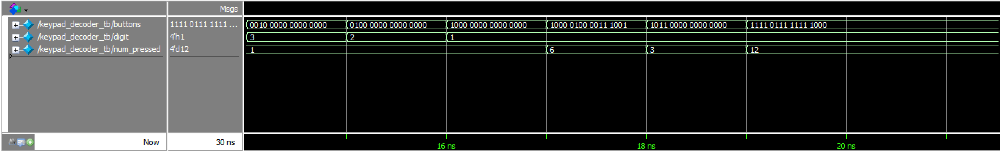

These waveforms exercise all possible 16 branches of the combinational logic (one for each button). It also tests a couple cases involving different numbers of buttons being pressed.

### Keypad Entry

Here are the waveforms for the `keypad_entry` module. This module is responsible for keeping track of the last two digits entered on the keypad.

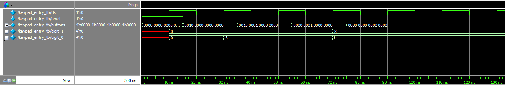

This waveform demonstrates basic functionality of the module:

- At 30ns, the module updates the rightmost digit to a `3` in response to the corresponding button being pressed
- At 35ns, the button `B` is held down in addition to `3`. The module rejects this additional keypress as per the specs
- At 55ns, the button `3` is released. This causes the keypad to transition from a multi-press state to a single-press state, which should register an additional keypress in accordance with the specs
- At 70ns, the display updates with `B` as the rightmost digit and moves the `3` over to the leftmost digit

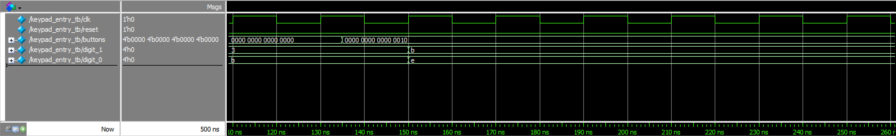

This waveform shows the module properly keeping track of the two most recently entered digits on the keypad, with the most recent digit appearing on the right (`digit_0`).

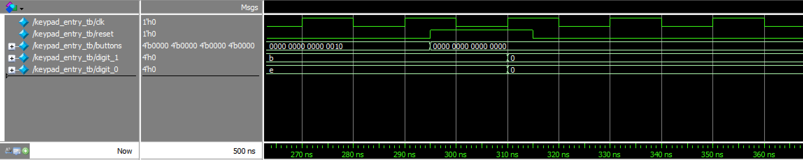

This waveform demonstrates the reset functionality.

### Keypad Multipress

Here are the waveforms for the `keypad_multipress` module. This module is responsible for keeping track of how many buttons are being pressed and telling the `keypad_entry` module when to update.

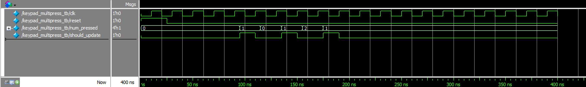

This waveform demonstrates the key state transitions of the module:

- going from 0 presses to 1 press
- going from 1 press to multiple presses
- going from multiple presses to 1 press
- going from 1 press to 0 presses

The module only outputs `should_update` when entering the 1-press state from a 0-press or multi-press condition.

### Keypad Settler

Here are the waveforms for the `keypad_settler` module. This module tells the `keypad` module not to look at the column inputs right after a row change, because I was running into issues polling the keypad rows too fast.

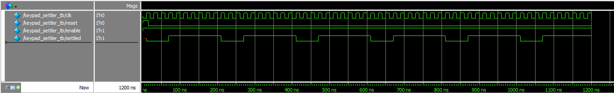

In this case, the output goes low for 3 clock cycles and then high for 7 clock cycles. The exact period can be configured to line up with the keypad's `POLL_DELAY`.

### Keypad Poller

Already verified, same as the `scanner` module from Lab 2.

### Synchronizer

This module synchronizes asynchronous inputs, at the cost of introducing two clock cycles of delay.

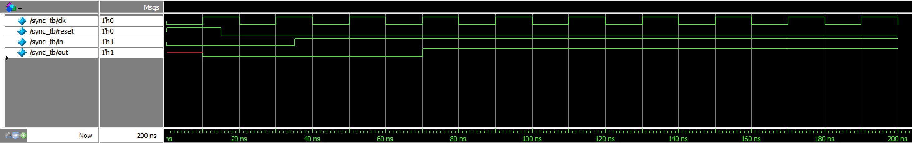