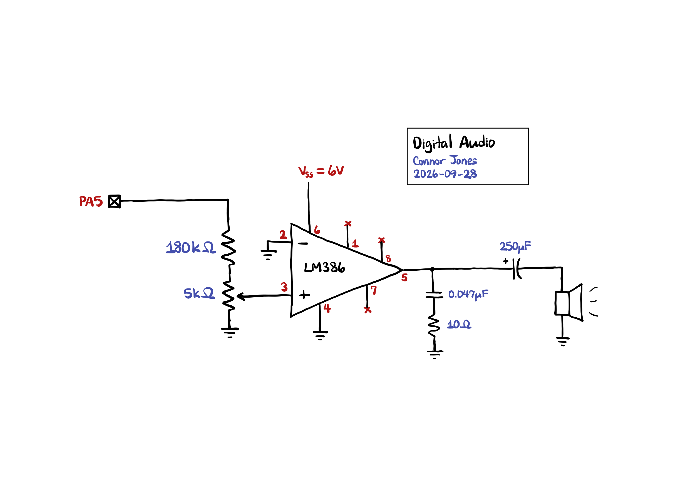

## Introduction

In this lab, I wired up a speaker to the MCU to play the notes in _Fur Elise_ by generating square waves on one of the GPIO pins.

The code used for this lab can be found at [this repository](https://github.com/conjoneshmc/e155-labs), under the `lab-4` folder.


## Timer Calculations

Timers 6 and 7 on the STM32 Nucleo 432KC were chosen for timekeeping due to their simplicity. `TIM6` was used to time the frequency of the square waves by setting the auto-reload register such that it would overflow at a desired frequency. `TIM7` was used to time the lengths between notes by having the timer overflow after the note's duration and checking for the update event flag to know when it has elapsed. Calculations for these timers are discussed below.

### Frequency Timer (`TIM6`)

`MSI` was selected as the system clock running at the default frequency of **4 MHz**. According to the clock tree on the MCU datasheet, this clock passes through the `AHB` and `APB1` prescalers before reaching timers 6 and 7. `AHB` was configured not to divide the clock, while `APB1` was configured to divide by a factor of `16`. However, these timers multiply their clock frequencies by 2 if `APB1` is set to anything other than 1, so the net clock division ratio for timers 6 and 7 is really `8`. Thus, the base clock frequency of both timers is **500 kHz**.

Each timer also comes with its own individual prescaler, allowing us to divide the clock frequency further. For `TIM6`, the prescaler register was set to `1`, which affects the clock frequency in the following manner:

::: {.callout-note collapse="true"}
## SPOILER: Click to show calculations

The timer frequency and input clock frequency are governed by the following relationship:

$$
  f_\mathrm{timer} = \frac{f_\mathrm{clk}}{\mathrm{PSC} + 1}
$$

where `PSC` is the value of the prescaler register. Thus, the prescaler divides the clock by `2`, giving us a timer frequency of **250 kHz**.
:::

We can then determine how to set the auto-reload register based on a desired input frequency:

::: {.callout-note collapse="true"}
## SPOILER: Click to show calculations

The auto-reload register of the timer and the desired frequency should be governed by the following relationship:

$$
  \mathrm{ARR} = \frac{f_\mathrm{timer}}{f_\mathrm{desired}} - 1
$$

where `ARR` is the value in the auto-reload register. We need to subtract `1` because `ARR` is inclusive.

I implemented the following helper function in my program to calculate `ARR` for me based on a given frequency:

```c
uint16_t freq_to_max_count(uint16_t freq) {
  return (uint16_t) (PITCH_TIMER_BASE_FREQ / freq - 1);
}
```
:::

This setup causes `TIM6` to overflow at the same frequency as our desired pitch. To achieve a 50% duty cycle of the square wave, we simply check whether the counter value is halfway to its maximum count and turn the GPIO pin on if so.

The following calculations demonstrate the minimum and maximum frequencies, as well as any errors introduced by floor division and dealing with integers:

::: {.callout-note collapse="true"}
## SPOILER: Click to show calculations for minimum and maximum frequency

The _minimum_ frequency supported corresponds to the longest period. The `ARR` register in the MCU is 16 bits, so setting it to the maximum value would give the timer a total of `65536` states. The minimum frequency supported is thus:

$$
  f_\mathrm{min} = \frac{250000}{65536} \approx 3.8147 \mathrm{Hz}
$$

The _maximum_ frequency supported corresponds to the shortest period that has at least one "on" state and one "off" state. Setting the `ARR` to `1` makes the counter have exactly `2` states, one for turning the GPIO pin on and another for turning it off. The maximum frequency supported is thus:

$$
  f_\mathrm{max} = \frac{250000}{2} = 125000 \mathrm{Hz}
$$
:::

::: {.callout-note collapse="true"}
## SPOILER: Click to show calculations for percent error

For an input frequency of **220 Hz**, the actual value loaded into the `ARR` register becomes:

$$
  \mathrm{ARR} = \left\lfloor \frac{250000}{220} \right\rfloor - 1 = 1135
$$

This means the counter will have `1136` states (because `ARR` is inclusive). To find the actual frequency produced by the square wave, we divide the timer frequency by the number of states:

$$
  f_\mathrm{actual} = \frac{250000}{1136} \approx 220.070422
$$

The percent error is thus **0.032%**, well within the 1% accuracy required by the specs.

Repeating the calculations for **1000 Hz** actually gives us a percent error of **0%**, meaning the system can (theoretically) perfectly replicate this frequency. This makes sense because the frequency ratio between 250 kHz and 1000 Hz is an integer, so there are no errors introduced by doing floor division and storing the max count as an integer in C.

These calculations are not sufficient to prove that all notes in _Fur Elise_ can be played with this accuracy, because each note has a different frequency ratio with the base timer frequency and could all have different percent errors. I used the `Union[]` function in Mathematica to remove all duplicate frequencies and filter only the unique notes used in the song:

```
{262, 319, 330, 349, 392, 416, 440, 494, 523, 587, 623, 659, 699}
```

Then, I wrote a small function to calculate the percent error of each note:

```m
percentError[fDes_] = Block[{fBase, fActual},
  fBase = 250000;
  fActual = fBase / Floor[fBase/fDes];
  (Abs[fDes - fActual] / fActual * 100) // N
];
```

Running this function on each of the pitches produces the following table:

| Pitch (Hz) | Percent Error (%) |
| ---------: | ----------------: |
|        262 |            0.0208 |
|        319 |            0.0892 |
|        330 |            0.0760 |
|        349 |            0.0464 |
|        392 |            0.1184 |
|        416 |            0.1600 |
|        440 |            0.0320 |
|        494 |            0.0144 |
|        523 |            0.0024 |
|        587 |            0.2100 |
|        623 |            0.0708 |
|        659 |            0.0956 |
|        699 |            0.1828 |

Thus, all of the notes in _Fur Elise_ can be replicated to within 1% accuracy in terms of pitch.
:::

### Duration Timer (`TIM7`)

For `TIM7`, `PSC` was set to `31` making it divide the clock by a factor of `32` according to calculations from the previous section. Thus, the timer frequency is **15625 Hz**.

The calculations for setting the auto-reload register are slightly different because we want the timer to overflow after a set duration, not at a set frequency:

::: {.callout-note collapse="true"}
## SPOILER: Click to show calculations

The auto-reload register of the timer and the desired duration should be governed by the following relationship:

$$
  \mathrm{ARR} = f_\mathrm{timer} \cdot \mathrm{duration} - 1
$$

where `ARR` is the value in the auto-reload register. Again, we need to subtract `1` because `ARR` is inclusive.

I implemented the following helper function in my program to calculate `ARR` for me based on a given duration in milliseconds:

```c
uint16_t duration_to_max_count(uint16_t duration) {
  return (uint16_t) ((DURATION_TIMER_BASE_FREQ * duration) / 1000 - 1);
}
```
:::

The following calculations demonstrate the minimum and maximum durations:

::: {.callout-note collapse="true"}
## SPOILER: Click to show calculations for minimum and maximum duration

The _maximum_ duration supported corresponds to the longest period. The `ARR` register in the MCU is 16 bits, so setting it to the maximum value would give the timer a total of `65536` states. The maximum duration supported is thus:

$$
  \mathrm{duration}_\mathrm{max} = \frac{65536}{15625} \approx 4.1943 \mathrm{s}
$$

The _minimum_ duration supported corresponds to the shortest period. Setting the `ARR` to `0` makes the counter have exactly `1` state, which just generates an overflow event every clock cycle. The minimum duration supported is thus:

$$
  \mathrm{duration}_\mathrm{min} = \frac{1}{15625} \approx 0.000064 \mathrm{s}
$$
:::


## Schematics

I followed the recommended schematic for building an LM386 amplifier with a gain of `20` according to the [datasheet](https://www.ti.com/lit/ds/snas545d/snas545d.pdf?ts=1790615184073&ref_url=https%253A%252F%252Fwww.google.com%252F).



Not shown is a 10 uF capacitor between Vss and GND to stabilize the power supply. The non-inverting input of the amplifier is attached to the terminals of a potentiometer, allowing the volume to be adjusted.


## Results and Conclusion

After testing the design in hardware, it fully meets all specifications. The notes of _Fur Elise_ are played at the correct tempo and with the right pitch, and rests are played appropriately. In addition, I programmed two extra tunes into the MCU that could be played over the speaker.

I spent a total of **12 hours** on this lab. The design was fully working in hardware after about **10 hours**, and I spent the remaining time doing the writeup.


## AI Prototype

I gave ChatGPT the following prompt:

> What timers should I use on the STM32L432KC to generate frequencies ranging from 220Hz to 1kHz? What’s the best choice of timer if I want to easily connect it to a GPIO pin? What formulae are relevant, and what registers need to be set to configure them properly?

The AI's response can be found [here](https://chatgpt.com/share/6abb4325-8f8c-83e8-ad0c-be3d0e57648c).

- I found the AI's output to be very useful. It documented all the timers available on the MCU and their features, and selected `TIM2` due to having four output channels and a 32-bit counter.
- The response included all relevant formulas for calculating PWM frequency and duty cycle. It also warned of a common pitfall if you choose to modify the `APBx` prescaler, since that causes the timers to run at twice their input clock frequency.
- It recommended a prescaler value of `79` (assuming an input frequency of **80 MHz**) to divide down the timer frequency to **1 MHz**, making the math a lot easier. However, because the counter is 32-bits, the prescaler isn't strictly necessary.
- It gave the necessary register configuration to set `PA0` into an alternate-function mode, allowing the timer to directly drive the GPIO pin.
- It also provided boilerplate code to write to these registers at the bare-metal level.

For this lab, I chose `TIM6` and `TIM7` even though the AI response recommended against it because they were the simplest to work with and required the least amount of configuration. Reading through the documentation and reference manual for the timers was already taking me a huge portion of the time spent on lab, and I didn't want to waste any more time trying to understand the workings of the more complicated timers when the basic ones did just fine.