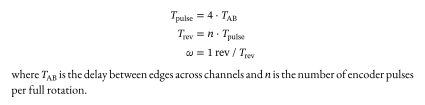
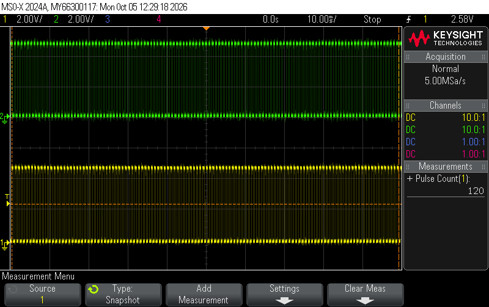
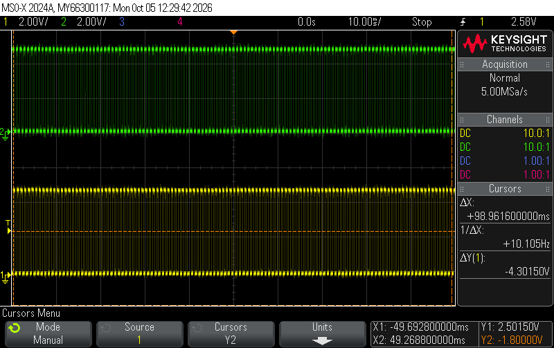
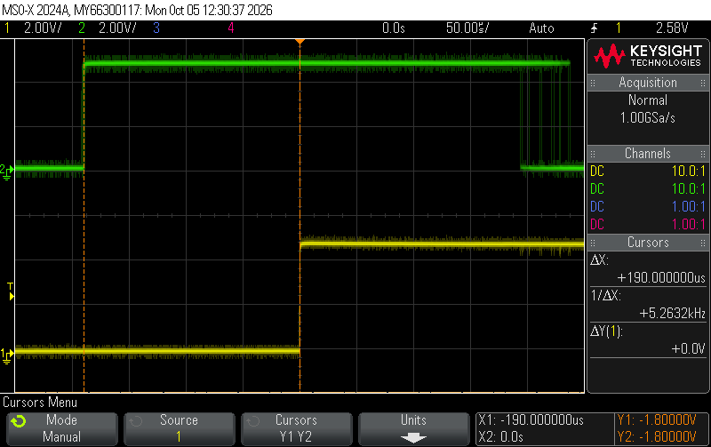
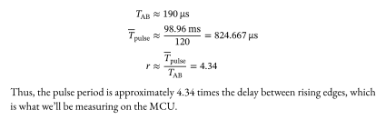

## Introduction

In this lab, I connected a quadrature encoder from a motor to the MCU and measured the time between pulses on each encoder channel to determine the angular speed and direction of the motor.

The code used for this lab can be found at [this repository](https://github.com/conjoneshmc/e155-labs), under the `lab-5` folder.

## Strategy

The quadrature encoder on the motor uses two hall effect sensors to track the movement of a patterned disk attached to the motor. When the motor spins, the rotating disk causes the sensor to generate a series of pulses in the form of a square wave. The two sensors are positioned such that the pulses generated are 90° out of phase. Only one encoder channel is needed to measure the speed, but the addition of a second channel enables us to determine the direction of rotation.

To strategize how to best use the encoder channel outputs to measure speed, I hooked up both channels to an oscilloscope, connected the motor to a power supply, and observed the waveforms generated. I first noticed that the pulses were very uneven. The period of each pulse varied significantly and the duty cycle was not exactly 50%. I suspect this is due to the patterns on the disk not being even in length. This ruled out the approach of counting the number of pulses in a set period of time, since the pulse length would have to be fairly consistent to get accurate measurements.

What _was_ consistent in the waveforms was the time between similar edges of both encoder channels. That is, the time between one rising edge on A and the next rising edge on B was very steady, even as other features on the wave fluctuated greatly. This is because variations in the patterned disk do not affect the time between edges on the encoder channel, as long as the motor rotates at a constant speed. If the motor speeds up, this length of time will shorten, and vice versa. Thus, we should be able to correlate this measurement with the motor's velocity.

### Determining the Speed from Pulse Length

Assuming the encoder channels are exactly 90° out of phase, the time between similar edges across both channels should be roughly a quarter of the total pulse period. Since the number of encoder pulses in a full rotation is given to us, we can estimate the amount of time it would take the motor to make 1 revolution and thus determine the motor's speed:

{fig-align="center"}

Unfortunately, I found that the encoders were **not** exactly 90° out of phase, partly because of the fluctuating period length. To address this issue, I experimentally determined the ratio between the total pulse period and the time between edges via the following procedure:

1. I configured the oscilloscope to count the number of pulses on screen and zoomed out until there was 120 pulses within the measurement window. I chose 120 because that was the number of pulses per rotation for my motor, so any variations in pulse length will become averaged out. _(first screenshot)_
2. I measured the total length of these pulses, then found the average pulse length by dividing by 120. _(second screenshot)_
3. I measured the time between rising edges across encoder channels A and B. _(third screenshot)_
4. I divided the average pulse length by the rising edge delay to figure out the actual ratio between pulse period and edge delay.

The screenshots above show oscilloscope traces measuring the experimental values described in my procedure. Calculations for the delay-to-pulse period ratio:

{fig-align="center"}
