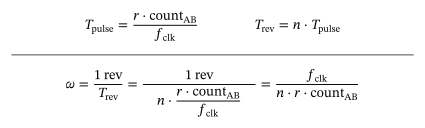
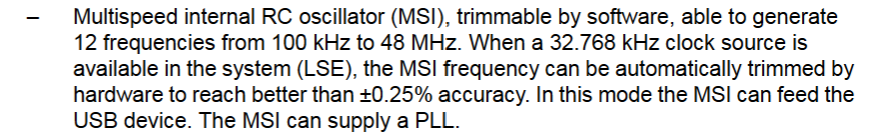
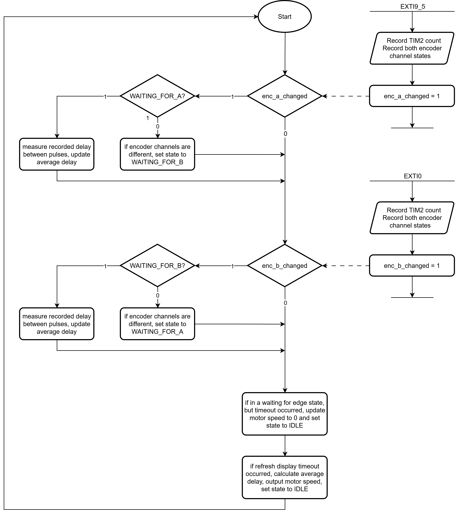
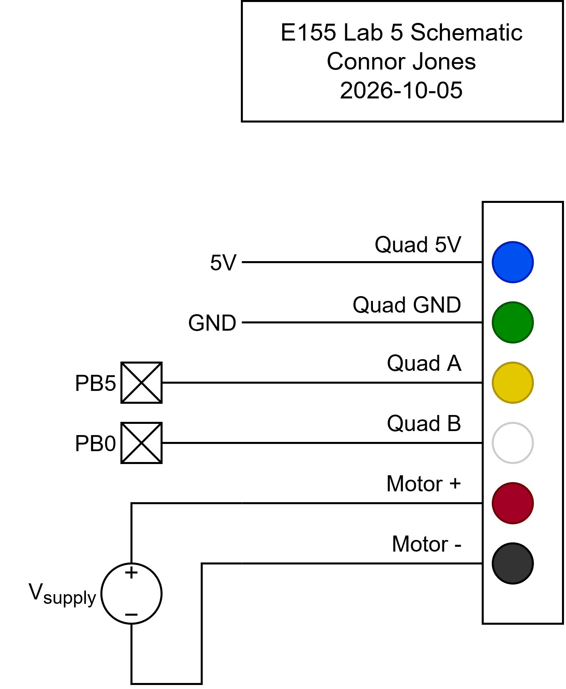

## Introduction

In this lab, I connected a quadrature encoder from a motor to the MCU and measured the time between pulses on each encoder channel to determine the angular speed and direction of the motor.

The code used for this lab can be found at [this repository](https://github.com/conjoneshmc/e155-labs), under the `lab-5` folder.

## Strategy

The quadrature encoder on the motor uses two hall effect sensors to track the movement of a patterned disk attached to the motor. When the motor spins, the rotating disk causes the sensor to generate a series of pulses in the form of a square wave. The two sensors are positioned such that the pulses generated are 90° out of phase. Only one encoder channel is needed to measure the speed, but the addition of a second channel enables us to determine the direction of rotation.

To strategize how to best use the encoder channel outputs to measure speed, I hooked up both channels to an oscilloscope, connected the motor to a power supply, and observed the waveforms generated. I first noticed that the pulses were very uneven. The period of each pulse varied significantly and the duty cycle was not exactly 50%. I suspect this is due to the patterns on the disk not being even in length. This ruled out the approach of counting the number of pulses in a set period of time, since the pulse length would have to be fairly consistent to get accurate measurements.

What _was_ consistent in the waveforms was the time between similar edges of both encoder channels. That is, the time between one rising edge on A and the next rising edge on B was very steady, even as other features on the wave fluctuated greatly. This is because variations in the patterned disk do not affect the time between edges on the encoder channel, as long as the motor rotates at a constant speed. If the motor speeds up, this length of time will shorten, and vice versa. Thus, we should be able to correlate this measurement with the motor's velocity.

### Determining the Speed from Pulse Length

Assuming the encoder channels are exactly 90° out of phase, the time between similar edges across both channels should be roughly a quarter of the total pulse period. Since the number of encoder pulses in a full rotation is given to us, we can estimate the amount of time it would take the motor to make 1 revolution and thus determine the motor's speed:

{fig-align="center"}

Unfortunately, I found that the encoders were **not** exactly 90° out of phase, partly because of the fluctuating period length. To address this issue, I experimentally determined the ratio between the total pulse period and the time between edges via the following procedure:

1. I configured the oscilloscope to count the number of pulses on screen and zoomed out until there was 120 pulses within the measurement window. I chose 120 because that was the number of pulses per rotation for my motor, so any variations in pulse length will become averaged out. _(first screenshot)_
2. I measured the total length of these pulses, then found the average pulse length by dividing by 120. _(second screenshot)_
3. I measured the time between rising edges across encoder channels A and B. _(third screenshot)_
4. I divided the average pulse length by the rising edge delay to figure out the actual ratio between pulse period and edge delay.

The screenshots above show oscilloscope traces measuring the experimental values described in my procedure. Calculations for the delay-to-pulse period ratio:

{fig-align="center"}

Thus, the pulse period is approximately 4.34 times the delay between rising edges, which is what we'll be measuring on the MCU.

Also, the measurement being made by the MCU timer is a counter value, not necessarily time. So we'll also need to factor in clock frequency into our math. The final calculations to go from edge delay to motor speed in rev/s look like:

{fig-align="center"}

In code, the clock frequency is represented as the constant `TIMER_FREQ_HZ`, _n_ is represented as `PULSES_PER_ROTATION`, and _r_ is represented as `PULSE_TO_DELAY_RATIO`.

### Determining the Direction of Rotation

We can also determine the direction of rotation by observing the order in which edges occur. During counter-clockwise rotation, rising edges from B always precede rising edges from A, and falling edges from B always precede falling edges from A (see scope traces from previous section). Conversely, during clockwise rotation, this ordering is reversed. Thus, during the interrupt handler, we need to make a note of the state of _both_ encoder channels to know which edge is happening before the other. If we see a rising edge from B while A is still low, for example, we know that B's edges are happening _before_ A's edges. Likewise, if we see a rising edge from B while A is also high, we can conclude that B's edges are happening _after_ A's edges.

A high-level overview of a state machine to implement this logic looks like:

1. Start in an "idle" state.
2. When any edge from A occurs, do the following:
   1. If the state of the encoder channels after the edge _is not_ equal (e.g. rising A edge with B low, or falling A edge with B high), we know the direction of rotation must be **clockwise**, since A's edges precede B's edges. Record the time of this edge and put the system into a "waiting for B edge" state.
   2. If the state of the encoder channels after the edge _is_ equal, _and_ the system is in a "waiting for A edge" state, we are rotating **counterclockwise** (B's edges precede A's edges). Record the time of this edge, and find the difference between now and the time of B's last edge. This delay will be used to calculate the motor's speed using the formulas mentioned previously.
   3. If none of the above apply, we must be in some invalid state, so just reset the system back to the "idle" state. This might happen if the motor switches direction and the ordering of pulses reverses.
3. When any edge from B occurs, implement the conserve logic outlined above.
4. If the system is in some kind of "waiting for edge" state, but we haven't seen an edge occur within a certain timeout, assume the motor has stopped spinning, record its speed as zero, and reset the system into an "idle" state.

To smooth out any variations in recorded pulse delay, a running average is taken. More details will be shown in the main loop flowchart.

### Update Rate and Resolution

The display was programmed to update at a rate of every 50ms, giving a 20 Hz refresh frequency.

The timer runs at the same frequency as the system clock (32 MHz), so it has a resolution of 31.25ns. I experimentally determined that the shortest length of time needed to be measured while the motor is powered at 30V was on the order of ~100us, about 3200x the clock period. Thus, the system clock frequency should be more than enough for our purposes.

Additionally, I enabled the internal PLL compensation feature of the MSI clock, which enables accuracy to within 0.25% according to the datasheet:

## Documentation

### Interrupt Handler Flowchart

Compared to polling at high speeds, interrupts enable the MCU to accurately record the time of GPIO pulses much better. I used the disassembly in SEGGER to count the number of instructions in my main while loop and found that it was around 200 (assuming all instructions are executed). Note that this does not include function calls, so the actual number of instructions is likely larger. At 32 MHz, it would take roughly 6us to execute a single loop, which would significantly affect measurements of the motor at high speeds (which have pulse delays on the order of 100us). Furthermore, the `printf()` calls to display the motor speed add even more overhead.

---

### Schematic

{fig-align="center" width="40%"}

Very little circuity was required to interface with the encoder. In fact, the pins can just be connected directly to the MCU since PB0 and PB5 are 5V tolerant.

## Results and Conclusion

The design meets all specifications in hardware. When 12V is applied to the motor, it measured a speed of roughly 10.3 rev/s. It also correctly distinguishes between different directions of rotation and works with very low or high speeds.

I spent **20 hours** on this lab, and initially got it working in hardware after about 14 hours.

## AI Prototype

Prompt:

> Write me interrupt handlers to interface with a quadrature encoder. I’m using the STM32L432KC, what pins should I connect the encoder to in order to allow it to easily trigger the interrupts?

The AI response can be viewed [here](https://chatgpt.com/share/6ac49215-aa40-83e8-93fd-b20d5324d1ce).

The AI suggested using `PA0` and `PA1` for the quadrature encoder inputs because they have alternate functions connected directly to the TIM2 channels. TIM2 can then be configured to operate in encoder mode and drive the counter automatically, eliminating the need to do any manual measurement of the encoder. I also thought about doing the lab this way, but `PA1` is not exposed on the breadboard connector, so this was not an option for me.

The code provided uses a simple state machine based on the four possible combinations of encoder outputs, which increments or decrements a counter at certain transitions. This solution only counts the number of pulses, but does not time them, so you would still need to set up a separate timer to determine the motor's velocity. I prefer my solution because it only requires one timer to be running continuously, without any additional configuration.